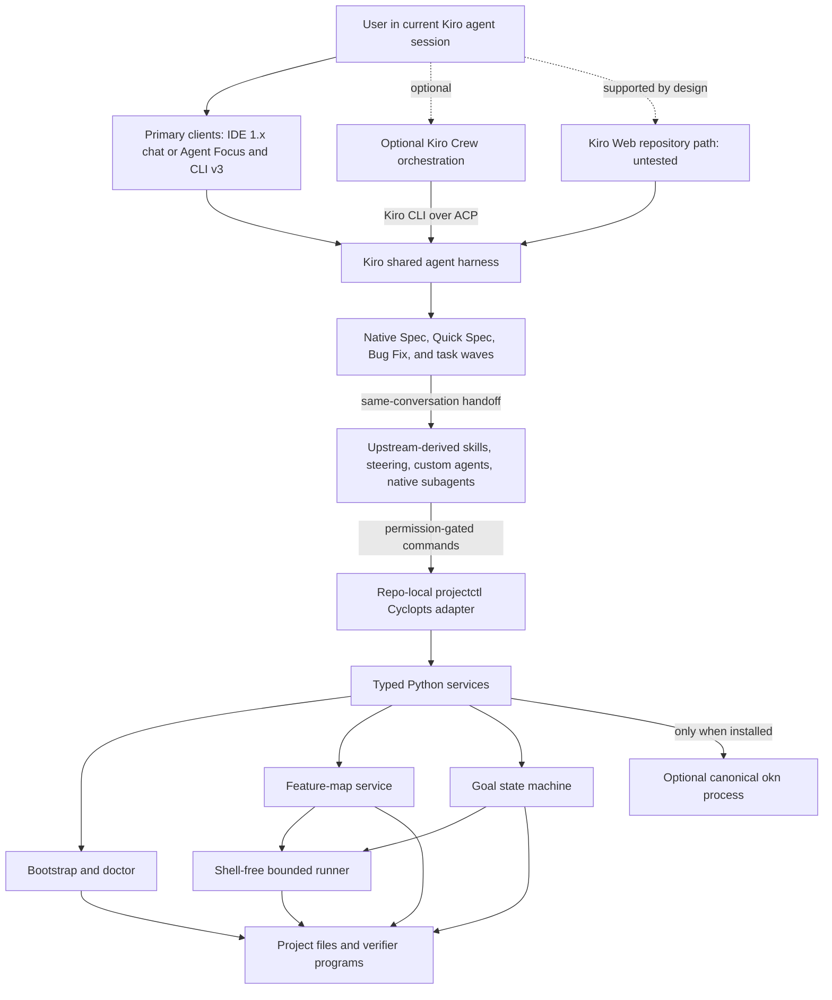
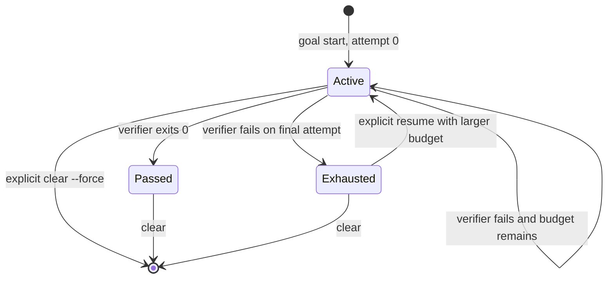

# Architecture

## Purpose and boundary

PK-Stack adds verified-development workflow semantics to a current Kiro agent
session. Kiro CLI v3 and Kiro IDE 1.x chat/Agent Focus are the primary
surfaces; Kiro Crew is a compatible optional orchestrator; Kiro Web consumes
committed workspace assets by design but is untested. PK-Stack is a Power plus
a thin repo-local control surface, not another agent runtime.

The governing rule is:

> Kiro owns execution and native planning. PK-Stack owns workflow semantics.
> `projectctl` owns project operability and executable evidence. Source-controlled
> OKF plus canonical `okn` owns broader project knowledge.

The design exposes three project interfaces:

| Interface | Role | Owner |
| --- | --- | --- |
| `.pstack/bin/projectctl` | **DO** — setup, diagnostics, feature operations, and bounded goal state | PK-Stack |
| `Wiki/features/*.md` | **PROVE** — user-observable behavior plus an executable verifier | Project repository |
| Other `Wiki/`/OKF material | **KNOW** — architecture, decisions, concepts, and operations | Project repository plus canonical `okn` |

The versioned Kiro surface is documented in
[Kiro surface compatibility](kiro-v3-compatibility.md). Operational commands and
recovery procedures are in [Usage](usage.md). Porting provenance is in
[Provenance and porting boundary](provenance.md).

## Component map



Kiro decides when to inspect, edit, invoke a native subagent, or request a
project command. The Python package does not call a model. It parses explicit
inputs, returns structured values, and persists only managed-file receipts,
repository discovery, and bounded goal evidence.

## Native planning and the PK-Stack wrapper

For nontrivial feature and bug work, Kiro's built-in Spec, Quick Spec, or Bug Fix workflow is the
planning spine. Kiro owns `requirements.md` or `bugfix.md`, `design.md`, `tasks.md`, dependency-wave
analysis, task status, and native parallel execution. Standard Spec is the default for unfamiliar,
cross-boundary, high-risk, or requirements-sensitive work. Quick Spec is appropriate for bounded,
well-understood changes that do not benefit from approval between phases. An obvious one- or
two-file change may skip a native artifact with an explicit reason.

PK-Stack cannot and does not emulate a client slash command from inside a workspace skill. In CLI
v3, the user enters `/spec new <name>`, `/spec <name>`, or `/spec run <name>`, then runs `/agent swap
pstack` after the native phase. In the IDE, **Build with spec** or the workflow picker provides the
same handoff before `pstack` is reselected. This remains one user conversation, but the selected
built-in and project agents have distinct tool/resource scopes. Web uses its built-in primary and
native Spec picker. Crew can run a committed spec through its Task Runner; PK-Stack makes no claim
that Crew exposes the same local built-in-agent switch.

Once the native artifacts are complete, PK-Stack composes the applicable upstream-derived skills
around them and binds the plan to executable evidence. `projectctl goal bind-spec <name> --feature
<slug>` validates the artifact shape and writes one small bridge. The feature's verifier remains
the predicate; the goal state records both the native spec and feature provenance. No Kiro task
checkbox, prose acceptance criterion, or second task graph is treated as proof.

## Distribution and workspace materialization

The source repository is an Agent Plugins Power and a Python distribution:

```text
plugin.json
skills/*/SKILL.md
dev.kiro/steering/*.md
src/pstack_kiro/*.py
templates/project/.kiro/{agents,hooks}/*
templates/projectctl/uv.lock
```

The wheel force-includes the skills, steering, project templates, and
repo-local runtime lock under `pstack_kiro/_assets/`. The same bootstrap logic
therefore works from a source checkout or an installed wheel.

The Power-local `skills/setup-pstack/scripts/setup_pstack.py` is the setup and
upgrade authority. It resolves source and assets relative to its loaded Power;
it never executes a repository-supplied root `projectctl` to identify a
PK-Stack installation.
After a successful setup, skills use only `.pstack/bin/projectctl`.
The cached controller's `setup` command requires an explicit reviewed
`--power-root`; without one it fails instead of treating its own cached files
as a current Power.

Kiro steering preserves two upstream pervasive triggers without copying
Cursor-only skill frontmatter. `pstack-unslop.md` is always included, while
`pstack-typescript.md` uses Kiro's native `fileMatch` mode with the exact
`**/*.ts` and `**/*.tsx` patterns. Their on-demand skills retain the fuller
workflow and references.

A bootstrapped project contains:

```text
<project>/
├── projectctl                              # optional convenience wrapper if unowned
├── .gitignore                              # PK-Stack runtime block appended
├── .pstack/
│   ├── bin/projectctl                      # authoritative repo-local wrapper
│   ├── bootstrap.json                      # strict managed-file receipt
│   ├── discovery.json                      # read-only repository inventory
│   ├── projectctl/
│   │   ├── pyproject.toml                  # package = false
│   │   ├── uv.lock                         # shipped exact dependency lock
│   │   ├── src/pstack_kiro/*.py
│   │   ├── skills/ and dev.kiro/           # cached workflow assets
│   │   └── templates/                      # cached project templates and lock
│   └── state/goal.json                     # private ignored state while present
├── .kiro/
│   ├── agents/*.json
│   ├── hooks/*.json
│   ├── skills/*/SKILL.md                 # 48 live workflow skills; setup stays Power-local
│   └── steering/*.md
└── Wiki/features/
    └── README.md
```

If the root name `projectctl` is absent, bootstrap may create a convenience
wrapper that delegates to `.pstack/bin/projectctl`. If that name is already
owned, it is preserved. No skill selects or trusts the root name.

### Locked repo-local runtime

The internal wrapper changes to the project root, prepares the locked
control-plane environment, and executes:

```text
uv sync --quiet --locked --no-config --project .pstack/projectctl
PYTHONPATH=.pstack/projectctl/src \
  .pstack/projectctl/.venv/bin/python -B -X pycache_prefix=/dev/null \
    -m pstack_kiro
```

The generated runtime declares `[tool.uv] package = false`. Its source is
loaded directly through `PYTHONPATH`, so `uv` resolves only the exact locked
runtime dependencies instead of building or installing a project package.
The runtime's `.venv/` is ignored. `uv sync` runs as a short-lived child, then
the wrapper directly executes that venv's Python so its `PATH`, `VIRTUAL_ENV`,
and `UV_*` changes cannot leak into later verifiers. The wrapper records whether
the caller had `PYTHONPATH`; `runner.py` restores that original value (or
absence) and strips the private marker variables before every proof. `-B` keeps
controller imports from writing bytecode caches; the null cache prefix also
keeps the interpreter from trusting a pre-existing local cache in
receipt-owned source. These interpreter flags stay in the controller and do not
change the host project's executable predicate.

### Bootstrap ownership and explicit upgrades

`.pstack/bootstrap.json` is a schema-validated ownership receipt with manager
name, schema version, and one SHA-256 hash per managed file. Manager/schema
mismatches, empty inventories, unsafe paths, and malformed hashes are rejected.
Doctor reuses bootstrap's read-only comparison primitive to check every
receipt-managed path and digest, including cached-only controller files and
live/cached assets that drift together. The receipt is not signed; it is an
inventory and change-detection mechanism, not an authorization boundary. It can
never trigger an automatic overwrite: replacement additionally requires the
current file to match the receipt and an explicit `--update-managed` run.

Every setup holds an exclusive `fcntl` lock on the project-directory file
descriptor across receipt loading, preflight, managed writes, hash recheck, and
receipt commit. The lock creates no workspace artifact, and competing setup
processes serialize instead of interleaving a mixed runtime. Every setup then
begins with a complete no-write preflight. If any managed path is a
conflict, a managed upgrade is pending, or a retired managed path remains, no
managed file or new receipt is written. The decision table is:

| Existing state | Preflight result |
| --- | --- |
| Target is absent | `created` |
| Target already equals desired content | `unchanged` |
| Target equals its prior receipt hash but the Power now differs | `pending_updates` unless `--update-managed` was explicitly supplied |
| Target differs from both desired content and its prior receipt hash | `conflicts`; preserve the target |
| A receipt-owned path is no longer shipped but still exists | `stale_managed`; require an explicit human removal decision |
| Target or a required parent has the wrong filesystem type | `conflicts`; preserve the path |
| A managed path contains a symlink | reject setup before writing |

The intended upgrade sequence is preview, review, preview with the explicit
upgrade flag, and apply with that same flag. `--update-managed` can replace only
a file that still matches its prior receipt hash; it never overwrites a user
modification. There is no automatic upgrade, stale-file pruning, or uninstaller.
Every `stale_managed` path stays in the old receipt until the user reviews and
removes that exact retired asset; a later clean setup then drops it from the
new receipt.

Before examining or changing the target, bootstrap requires the complete set of
source modules, workflow assets, agent/hook templates, steering, setup shim, and
runtime lock from the loaded Power. An incomplete Power fails preflight without
materializing a partial target.

Successful writes use a same-directory temporary file, `fsync`, permission
assignment, and `os.replace`. Immediately before committing the receipt,
bootstrap re-hashes every managed target and refuses the receipt if any content
changed. Discovery does not execute detected project code;
it inventories selected language, test, developer-interface, Kiro,
verification, knowledge, and AWS markers. Its payload is deterministic,
root-relative (`"root": "."`), sorted, and contains no machine-local optional
tool availability. Because discovery is an owned observation rather than
shipped program content, a repository change refreshes `.pstack/discovery.json`
without the managed-upgrade gate.

An applied idempotent setup also normalizes managed executable files to `0755`
and managed text/receipt files to `0644`. A dry run reports the content plan but
does not change modes.

## `projectctl` and service boundaries

`src/pstack_kiro/cli.py` is a Cyclopts adapter. It parses the public hierarchy,
renders text or JSON, maps domain failures to structured errors, and chooses
exit codes. Domain behavior remains in ordinary Python services:

| Module | Responsibility |
| --- | --- |
| `bootstrap.py` | Two-phase ownership-aware materialization |
| `discovery.py` | Read-only repository inventory |
| `doctor.py` | Receipt-wide, runtime, Kiro-asset, feature-map, ignore, and goal-state checks |
| `features.py` | Feature generation, loading, validation, lookup, and proof binding |
| `evidence.py` | Bounded local decision/evidence JSONL, reference validation, locking, and audit |
| `goal.py` | Single-goal state machine, locking, integrity checks, and audit history |
| `runner.py` | Shell-free process execution, hazard screen, timeout, and bounded evidence |
| `upstreams.py` | Strict manifest/review ledger, fixed-origin GitHub reproof, generated parity, and transactional pin acceptance |
| `knowledge.py` | Optional subprocess boundary to canonical `okn` tooling |
| `paths.py` | Lexical workspace containment and symlink-component rejection |
| `models.py` | Strict typed wire values and status vocabulary |

Agent-facing examples use `--output json`. Transport or validation failures
emit `ok: false`, `error`, and `error_type`. An executed verifier records its
exit code, stdout, stderr, duration, timeout status, truncation status, and
start time.

### Hash-pinned upstream maintenance

`upstream check` treats `maintenance/upstreams.json`, its required
`maintenance/upstream-reviews.json` ledger, and all remote responses as untrusted data. Both local
files have exact schemas; project-relative manifest, ledger, and provenance paths reject traversal
and every symlink component. Each ledger source is bound to the manifest repository, subtree, and
provenance identity. Its genesis and 8 MiB byte-bounded transition list (with a conservative
512-entry parser ceiling) must form one strict contiguous chain whose tip exactly equals the manifest pin.
Each transition binds prior/new commit and subtree identities, the exact inventory digest, and one
bounded, nonempty A/B/C rationale per changed path.
Remote reads use `GET` only, disable ambient proxies and redirects, and are restricted before and
after the request to `https://api.github.com`. The optional `GITHUB_TOKEN` appears only in the
Authorization header. Timeouts, each response body, commit count, file count, tree entries, each
patch, and aggregate patch bytes are bounded; the timeout is one aggregate network budget rather
than a fresh allowance for every request.

For each source, the service resolves the pinned commit and current ref, walks the configured
subtree by content-addressed tree SHA, and reproofs the manifest pin. A changing ref must compare
as a bounded fast-forward whose base and merge base equal the pin and whose complete commit page
ends at the resolved head. It independently compares recursive pinned/current subtree trees and
requires GitHub's source-scoped compare records to account for that exact path set. The resulting
patches are escaped JSON text marked untrusted. Every hunk's actual body additions and deletions
must match both its hunk header and GitHub's metadata. For text changes, the service fetches only
the exact pinned blob, recomputes its Git object ID, applies the patch as data, and requires the
resulting Git object ID and size to equal the current subtree identity. Added text starts from an
empty byte string and removed text must end as one. Changed entries expose both old and new
type/mode/SHA/size identities; only regular blobs in mode `100644` or `100755` are supported, so
executable-bit changes are reviewable while symlinks and submodules fail closed. A canonical
SHA-256 binds the repository, exact base, head, source path, both identities, metadata,
reviewability class, and content. A missing patch fails for semantic content changes; only a
zero-count top-level raster asset, an exact-blob pure rename, or an exact-blob mode-only change is
permitted without one. Unavailable raster paths are machine-listed and require disposition B.
Nothing from upstream is executed. Each source also names one machine-validated parity artifact.
Cursor pstack uses the complete skill-package catalog; OKF methodology and specification sources
use exhaustive regular-blob inventories with A/B/C dispositions. An aggregate check validates every
source and reports all drift. `--source-id` retains the full local manifest/ledger validation but
fetches and reports only that exact source. Scheduled maintenance deterministically selects the
lexicographically first drifting source, and one proposal may advance only that source; the
transaction proves every deferred pin, ledger, parity result, and provenance file unchanged for a
later cadence.

The complete ledger chain is validated locally. The latest accepted
transition is re-fetched and its remote identities, fast-forward relationship, inventory digest,
and exact disposition path set are re-proved; Git history is the tamper-evident authority for
older committed ledger entries, keeping network work constant as history grows. An explicit
`--power-root` adds a bootstrap dry run with
`update_managed=True`, then reports whether canonical and managed outputs have any pending change;
the check never applies that preview.

At the current 27-path shape, a 400-byte rationale per path fits the 512-entry ceiling: roughly
9.8 years of weekly transitions. Maximum-length rationales can reach the 8 MiB byte bound sooner
(roughly 2.7 years at that same path count). Before either limit, maintainers must perform an
explicit reviewed, tamper-evident archive migration; the checker never rolls history over or drops
evidence automatically. The 20 MiB recovery-journal bound is tested against near-8 MiB before and
after ledgers.

`upstream accept` is the only machine path that advances a self-maintenance pin. It requires the
exact default manifest, canonical Power root, ephemeral `.pk-stack-maintenance/proposal.json`, and
an explicit expected head. The proposal itself supplies the selected `source_id`. Acceptance
freshly runs the same aggregate reproof and parity checks, requires that source's transition to
match the old pin, resolved head/subtree, inventory digest, and exhaustive path set, and supports a
no-write `--dry-run`. The applying form journals and atomically replaces only that source's
normalized ledger entry and manifest pin, can complete an interrupted transaction on the same
source/expected-head-bound rerun, and consumes all `.pk-stack-maintenance` state. It never edits
provenance, the Power, or any upstream content.

The ledger and its full ordered list of canonical `pk-stack-upstream-review` provenance markers
are the machine-authoritative transition record. The checker binds every marker 1:1 to its ledger
transition, not only the latest marker. Surrounding human-readable provenance prose is descriptive
and must remain accurate, but it is not parsed as transition authority. Ordinary `upstream check`
requires exact marker/ledger equality. Only the internal acceptance preproof permits one additional
tail marker, and only when it is byte-semantically bound to the strictly parsed proposal; an extra,
replaced, or reordered marker still fails. Once accepted, the appended ledger transition restores
ordinary exact equality.

## Feature maps: the PROVE interface

A feature contract is Markdown under `Wiki/features/`. Schema 2 frontmatter has:

- `type: feature`;
- `schema_version: 2`;
- a lowercase hyphenated `slug` matching the filename;
- a non-empty string `title`;
- an exact boolean `draft`;
- an optional `verification.command` as a string or non-empty list of strings;
  and
- optional `related` as a list of paths relative to the feature file.

The body retains non-empty `## User behavior` and `## Expected path` sections,
then structurally records:

- one or more identifier-keyed `## Sub-features`;
- every `## How to get to it (user POV)` entrypoint;
- the same ordered entrypoint IDs under `## Driving it`, each with one
  non-empty `#### Recipe` and `#### Observable proof`;
- non-empty `## Evidence boundary` and `## Cleanup boundary`; and
- one or more single-line `## Gotchas` bullets.

`feature validate` checks this exact ordered section schema, duplicate YAML
keys and headings, entrypoint-to-recipe coverage, filename and location,
related-path containment/existence, duplicate slugs, and verifier policy. A
draft without a command warns; a ready contract without a command fails.
Every feature document is capped at 512 KiB and read through bounded binary
I/O with strict UTF-8, pre/post size, identity, and concurrent-growth checks.
Schema 1 contracts remain readable so an upgrade does not strand an existing
goal, but validation emits a migration warning. `feature migrate` preserves
the existing behavior, expected path, verifier, related paths, and draft state
while adding the required structure. Automatic migration is permitted only
when every byte matches projectctl's canonical schema-1 rendering. Duplicate
known sections, pre-H2 prose, custom Verification prose, YAML comments or
formatting, unmodeled frontmatter or verification keys, and extra sections all
cause conservative refusal rather than data loss. Migrate those records
manually while preserving their operator-authored content. Migrating a ready
canonical record re-runs its verifier before replacement; failure or an exact
byte change during proof leaves the observed record untouched.

Structured `feature generate` pairs repeatable `identifier=text`
`--entrypoint`, `--drive`, and `--entrypoint-proof` values by exact order and
ID. Omitting all schema-2 fields preserves the legacy schema-1 interface and
reports `migration_required: true`; new workflows should not use that fallback.
`--ready` changes structured generation from authoring to authoring plus one
initial proof:

1. build the exact candidate Markdown without writing it;
2. parse it back and require an exact semantic round-trip, rejecting structural
   heading injection;
3. require every ready-contract related path to be contained and present;
4. require and policy-check `--command`;
5. run the verifier from the project root;
6. repeat the no-write candidate validation immediately before commit;
7. write `draft: false` only if the verifier passed; and
8. return the verifier as `initial_verification`.

A failed ready proof exits 1 and leaves a new target absent. For an existing
target, overwrite refusal and pure input validation happen before proof, and a
failed proof leaves the existing file unchanged. Every mutation uses one
process/thread-safe feature-map lock. Ready generation snapshots exact target
bytes before proof, then compares and writes under that lock; a changed target
is not overwritten. A non-overwrite create uses an atomic hard-link install,
so even a file planted after comparison cannot be clobbered. `--overwrite` is
therefore a deliberate file-replacement option, not permission to skip proof
or discard a concurrent update.

Ready status records that the command passed during generation. It does not
guarantee the repository remains green later; `feature verify` reruns the
stored command.

The initial verification-skill workflow instead supplies one bounded JSON plan
to `feature generate-map`. The plan must contain exactly three to five complete
schema-2 records, with unique slugs and an executable command for each.
Projectctl validates every record, executes exactly the named
`--representative` command once, revalidates the candidates, then writes that
record as published and every other record as draft. A failed representative
proof causes projectctl to write none of the map. The complete 3-5 record batch
is staged under the same feature mutation lock; every target is snapshotted
before proof, then rechecked for exact bytes, workspace location, and symlink
components. New targets use atomic no-clobber installation, and overwritten
bytes are boundedly snapshotted. If any later replace or directory sync fails,
projectctl restores every earlier target before returning failure, so an
ordinary I/O error cannot leave a partial or mixed map. `feature publish` then
snapshots and compares exact bytes around its proof and surgically changes only
the YAML `draft` scalar. Accepted H1/preamble and Verification prose remain
byte-for-byte intact. The maintenance workflow subsequently runs
`feature publish` once per remaining draft; each command must pass before that
record becomes published. `feature validate` and a later live maintenance pass
still cover the entire map—one representative proof is not evidence for the
other entrypoints or features.

## Decision/evidence trails

`projectctl evidence` records a compact public audit trail, not a transcript or
hidden reasoning. Its default target is
`.pstack/state/evidence/<slug>/decision-log.jsonl`, beneath the setup-managed
ignore rule. A committed trail requires both `--committed` and the exact
`--target Wiki/evidence/<slug>/decision-log.jsonl`; a target alone, a flag
alone, or another path fails before writing.

Each canonical UTF-8 JSONL event has exactly `schema_version`, `sequence`,
`timestamp`, `requirement`, `evidence`, `decision`, `artifact`, `verification`,
and `verdict`. Verdict is exactly `VERIFIED`, `NOT VERIFIED`, or
`INCONCLUSIVE`. Sequence starts at one and is contiguous. UTC timestamps are
strictly increasing; if the host clock does not advance, the service advances
the next timestamp by one microsecond. An existing empty ledger is invalid,
not a successful zero-event audit. An artifact is null or one canonical
workspace-relative regular-file path with an optional lowercase SHA-256. Path
traversal, dot/dotdot aliases, backslash separators, absolute paths, symlink
components, missing artifacts, and digest drift fail closed.

The service caps each text field at 4 KiB, each event at 24 KiB, the ledger at
2,048 events and 4 MiB, reference paths at 1 KiB, and explicitly hashed
artifacts at 32 MiB. Known credential shapes and secret assignments are
rejected without echoing the candidate value; callers record a redacted
pointer instead. This screen cannot identify every possible secret, so the
caller remains responsible for keeping credentials and personal data out.

Append holds a POSIX lock in ignored state, validates the complete prior file,
chooses the next sequence and timestamp, validates the complete candidate,
then fsyncs a same-directory temporary file, atomically replaces the ledger,
and fsyncs its directory. `evidence audit` rechecks exact keys and canonical
encoding directly from raw bytes, every bound, LF-only record separator,
sequence, timestamp, reference, optional digest, and secret screen. CRLF or
mixed separators fail; a Unicode line-separator character inside a JSON string
remains ordinary UTF-8 content in that one event. The byte-for-byte prior
prefix is preserved by convention, but
the ledger is not signed or tamper-proof; audit detects malformed or
inconsistent state rather than authenticating its writer.

## Verifier execution and its safety boundary

String commands are parsed with `shlex` and executed as argv with
`shell=False`. Pipes, redirects, substitutions, and compound syntax are not
interpreted. Direct shell interpreters are unsupported; executable project
scripts use their shebang. Recognized language interpreters must select an
explicit script or Python module through a deliberately small grammar, and
`uv run` accepts only documented, unambiguous wrapper options before recursively
screening its nested command. Unknown leading wrapper/interpreter options fail
closed.

The runner also rejects known destructive executables, informational-only and
context-free placeholder forms, mutating Git/cloud/infrastructure/container
operations, unsafe `uv run` wrappers, ordinary path operands that resolve
outside the project root, local file URL escapes, and known attached path-option
forms for common build/test tools.

The same policy is checked when a ready feature is proved, a feature map is
validated, a goal starts, and every verifier executes. It also rejects a small
set of context-free placeholder programs (`true`, `echo`, and similar forms)
and generic projectctl self-verification. The sole self-host exception is the receipt-managed,
executable, non-symlink `.pstack/bin/projectctl upstream check` with explicit project-contained
manifest and Power paths, JSON output, no unknown or duplicate options, and an optional timeout
bounded to 30 seconds. Predicate tools such as `test` remain available because they can fail based
on project state. Processes run in their
own process group. Output is drained concurrently into bounded head/tail
buffers, invalid UTF-8 is replaced, timeouts kill descendants, and lingering
descendants are killed at the end of a proof even if the parent exited.

This is an obvious-hazard/evidence screen, **not a sandbox, semantic proof
checker, complete parser for arbitrary CLI option grammars, or read-only
guarantee**. A renamed executable or allowed project script can still be an
irrelevant no-op, construct an outside path internally, modify files, use
inherited environment credentials, access the network, or perform any operation
allowed to the user.
Human review must establish that the predicate actually covers the claimed
behavior.
Kiro permissions and explicit human review become the authorization boundary
after selecting the Poteto Kiro primary profile with `/agent swap pstack` or a
launch with `--agent pstack`. The ambient setup
agent does not inherit the generated profile. The shipped primary and verifier
roles are deliberately different: the primary profile marks every canonical
`.pstack/bin/projectctl` shell invocation `ask`, while the verifier profile has no shell tool
and only inspects contracts and recorded evidence. Setup never changes the
user's global default agent.

## Goal state and the current-session loop

There is one goal slot per project. Schema version 2 is stored at
`.pstack/state/goal.json` and contains:

- a UUID goal identifier, objective, status, and timestamps;
- one immutable executable contract with `explicit`, `feature-map`, or `spec`
  provenance;
- for a spec contract, SHA-256 snapshots of its intent (`requirements.md` or `bugfix.md`),
  `design.md`, and `pstack-verification.json`, while `tasks.md` remains Kiro-owned mutable state;
- a SHA-256 `contract_digest` over canonical serialized contract data;
- `attempt_count` and `max_attempts`; and
- the last result plus append-only attempt history.

The digest detects accidental or unsynchronized command changes; it is an
integrity check, not a signature against a writer who controls the state file.
Loading also rejects wrong primitive types, unsupported schema versions,
unknown statuses/sources, inconsistent display text, invalid attempt/history
relationships, and terminal states that contradict their evidence.

An explicit command, a named feature, or a bridge at
`.kiro/specs/<name>/pstack-verification.json` can supply the contract. Exactly
one source is required. Spec names cannot contain traversal or path separators.
A prose acceptance criterion alone is not executable proof. A spec verifier is rejected without
consuming an attempt if its bound intent, design, or bridge changed. Those artifacts are checked
again after the command and a racing change discards the result.



There is no state-replacement shortcut. Starting while any state exists fails;
the prior state must be inspected and deliberately cleared. A passed goal
cannot resume.
An exhausted goal resumes only with at least one new attempt, and the total
budget is capped at 20.

A dedicated verification lock serializes verifier runs, and a separate state
lock serializes mutations. `goal status` reads the atomically replaced state
without acquiring or creating a lock, so it remains responsive while a verifier
runs and does not create state artifacts when no goal exists. After the process
finishes, projectctl reloads state and discards the result if any goal state
changed during execution. The goal file is mode `0600`, and `.pstack/state/` is
added to `.gitignore`.

The `/verified-goal` skill is the orchestration seam:

1. remain in the current Kiro agent session on the selected surface;
2. use `.pstack/bin/projectctl` for the whole loop;
3. inspect state and choose one executable acceptance contract;
4. make the smallest evidence-backed change;
5. run one `goal verify` attempt;
6. diagnose and repeat only while status is `active`; and
7. report completion only after status is `passed`.

Native subagents may help with bounded diagnosis or read-only review. The
primary session owns edits and final evidence. The disabled Stop tripwire is
advisory only and cannot schedule another model turn or complete a goal.

## OKF and `okn`: the KNOW interface

PK-Stack does not implement a second OKF graph, registry, validator, or broad-search runtime. Its
Kiro-native `/okf` skill selectively adapts the useful produce, maintain, and consume workflow
semantics from `scaccogatto/okf-skills`; it does not vendor or activate that project's
Claude-specific hooks, transcript backfill, validator, MCP server, or visualizer.
The source-controlled Wiki is a first-class context layer, while the external CLI remains an
optional runtime prerequisite so verification can degrade honestly on a fresh machine. If
canonical `okn` is on `PATH`, PK-Stack delegates through the bounded runner:

```text
okn validate Wiki
okn search Wiki <query>
```

`knowledge validate` always composes the narrow feature-map verdict with the broader OKF verdict;
installing `okn` never causes PROVE validation to disappear. If `okn` is absent, `knowledge status`
reports `feature-map-only`, `knowledge validate` validates only `Wiki/features/` and warns about the
missing broad check, `--require-okn` fails, and `knowledge search` fails. A
symlinked or escaping `Wiki` path is rejected before delegation.

The separate `okfcli/okf` project is not a transparent fallback. It can serve as an optional
independent CI conformance/SARIF check, but its result never silently substitutes for `okn` search,
query, lifecycle, or safety semantics.

## Kiro-native assets and permissions

Bootstrap installs Kiro-native assets:

- 48 workspace Agent Skills spanning verified goals, OKF knowledge, architecture, investigation,
  review, verification lifecycle, TDD, writing, TypeScript, cleanup, and
  individually discoverable engineering principles;
- the setup skill remains Power-local and is also cached under
  `.pstack/projectctl/skills/setup-pstack/`, so an old workspace copy cannot
  shadow an upgraded Power;
- three small always-on steering files plus a TypeScript `fileMatch` steering
  file for `**/*.ts` and `**/*.tsx`;
- one primary and three bounded JSON custom-agent profiles; the three read-only
  profiles carry an empty `toolsSettings: {}` discovery sentinel required by the
  exercised Kiro CLI 2.21.0 build, without moving authorization out of
  `permissions.rules`;
- a native subagent allow-list for architect, reviewer, and verifier; and
- standalone `version: "v1"` SessionStart and Stop hook files.

Profiles declare skills and steering explicitly, inherit the model selected by
the user, and disable implicit MCP and Power inclusion. All three delegated
profiles omit both `write` and `shell`; the verifier inspects the contract and
recorded evidence while the primary session executes the exact command. The
primary profile asks before ordinary filesystem writes and every canonical
`.pstack/bin/projectctl` command. Every Git shell command also asks; selected
destructive Git forms remain denied. Direct writes to bootstrap-managed
control-plane paths are denied. Tool omission is the delegated read-only
boundary; permission rules are defense in depth, not a subprocess sandbox.

The Poteto Kiro primary profile is repository-local but is not automatically
active. In Kiro IDE 1.x, setup hands off to the chat/Agent Focus agent picker.
In CLI v3, setup hands off to `/agent swap pstack`; if discovery requires a
fresh pre-goal session, the documented launch is `kiro-cli chat --v3 --agent
pstack`. Plain `--v3` continues to use the ambient default and does not receive
these rules.

Kiro Crew reads the same repository-local agents, skills, and steering when it
orchestrates Kiro CLI. Crew may use ACP internally, but remains optional and
does not become PK-Stack's launcher. Kiro Web reads committed project assets,
but its built-in agent remains primary and the `pstack` profiles are available
only as delegation targets. Web does not reproduce the IDE/CLI permission and
interactive-approval boundary.

Because that profile also sets `includePowers: false`, a later refresh stays in
the same chat. IDE users select the Power-enabled setup agent and then
`pstack` in the agent picker; CLI users run `/agent swap kiro_default`,
`/setup-pstack`, and `/agent swap pstack` (using the actual local setup-agent
name when different). No user-launched external ACP host, `kiro-cli acp`, or
nested Kiro process is involved.

The enabled SessionStart hook prints static orientation only. The Stop hook is
disabled because Stop is not a documented control loop.

## Deliberate non-dependencies

The normal path does not depend on:

- **A user-launched ACP host.** No external host is required for a skill to act
  in the current session. Kiro Crew's internal Kiro CLI/ACP connection is an
  optional product integration, not PK-Stack's default path.
- **Native `/goal`.** Kiro documents the command, but a sterile interactive
  CLI 2.21.0 V3 probe treated `/goal clear` as ordinary prompt text. PK-Stack
  does not invoke or require it; re-probe after runtime updates.
- **A Stop-hook loop.** A post-response hook cannot be treated as a guaranteed
  next-turn scheduler.
- **`/spawn` for fanout.** `/spawn` creates a separate user-managed session;
  native subagents are the bounded internal primitive.
- **A bundled OKF implementation.** Broad knowledge stays behind optional
  canonical `okn`.

## Current limitations

- There is one goal slot per repository, not a concurrent goal queue.
- Bootstrap and goal-state locking require POSIX `fcntl`; setup fails explicitly
  rather than running without an interprocess lock when it is unavailable.
- Goal schema version 1 is not migrated automatically to schema version 2.
- Bootstrap does not prune stale files or automate uninstall.
- A ready feature proves one generation-time run, not permanent correctness.
- Command screening cannot establish that arbitrary code is read-only.
- Workspace path checks reject existing symlink components but cannot prevent
  another process racing the filesystem after a check.
- Newly copied skills or the generated agent may require one explicit
  CLI `--agent pstack` launch or one fresh IDE chat for discovery. Once loaded,
  the verified-goal loop stays in its current Kiro agent session.
- IDE 1.0.437 is a first-class structural target but has no separate GUI
  end-to-end campaign in this snapshot.
- Crew is compatible and optional; Web is supported by repository-local design
  and explicitly untested. Web cannot select `pstack` as its primary agent.
- Native knowledge support is experimental, and broad OKF behavior requires a
  separately installed canonical `okn` executable.
