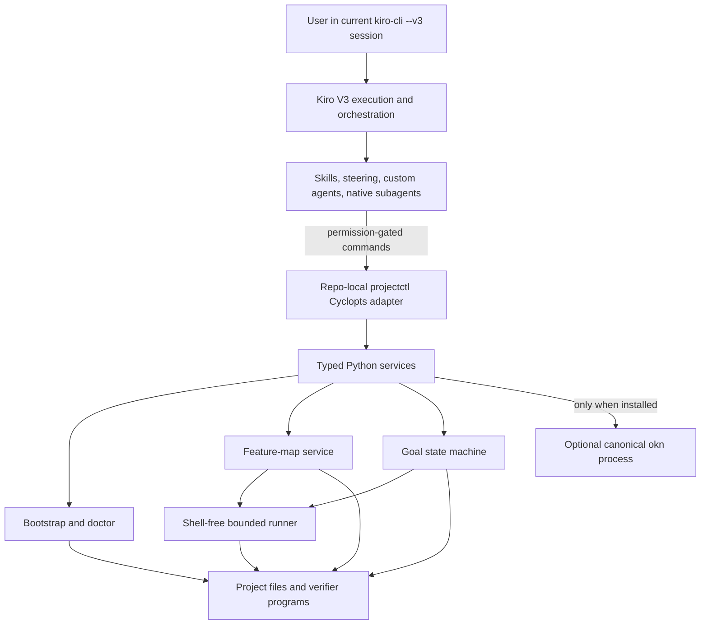
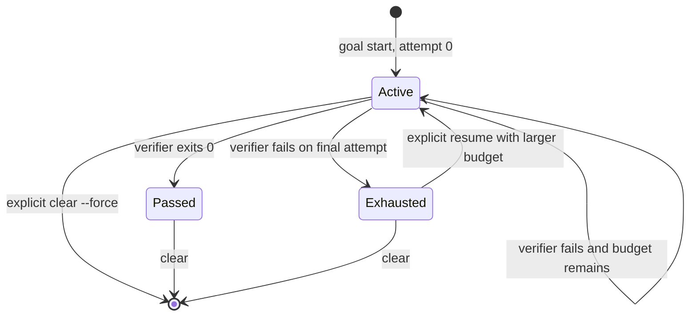

# Architecture

## Purpose and boundary

PK-Stack adds verified-development workflow semantics to an ordinary
interactive Kiro CLI V3 session. It is a Power plus a thin repo-local control
surface, not another agent runtime.

The governing rule is:

> Kiro owns execution. PK-Stack owns workflow semantics. `projectctl` owns
> project operability and executable evidence. OKF tooling, when present, owns
> broader project knowledge.

The design exposes three project interfaces:

| Interface | Role | Owner |
| --- | --- | --- |
| `.pstack/bin/projectctl` | **DO** — setup, diagnostics, feature operations, and bounded goal state | PK-Stack |
| `Wiki/features/*.md` | **PROVE** — user-observable behavior plus an executable verifier | Project repository |
| Other `Wiki/`/OKF material | **KNOW** — architecture, decisions, concepts, and operations | Optional canonical OKF implementation |

The versioned Kiro surface is documented in
[Kiro CLI v3 compatibility](kiro-v3-compatibility.md). Operational commands and
recovery procedures are in [Usage](usage.md). Porting provenance is in
[Provenance and porting boundary](provenance.md).

## Component map



Kiro decides when to inspect, edit, invoke a native subagent, or request a
project command. The Python package does not call a model. It parses explicit
inputs, returns structured values, and persists only managed-file receipts,
repository discovery, and bounded goal evidence.

## Distribution and workspace materialization

The source repository is an Agent Plugins Power and a Python distribution:

```text
plugin.json
skills/*/SKILL.md
dev.kiro/steering/*.md
src/pstack_kiro/*.py
templates/project/.kiro/{agents,hooks}/*
templates/projectctl/uv.lock
```

The wheel force-includes the skills, steering, project templates, and
repo-local runtime lock under `pstack_kiro/_assets/`. The same bootstrap logic
therefore works from a source checkout or an installed wheel.

The Power-local `skills/setup-pstack/scripts/setup_pstack.py` is the setup and
upgrade authority. It resolves source and assets relative to its loaded Power;
it never executes a repository-supplied root `projectctl` to identify a
PK-Stack installation.
After a successful setup, skills use only `.pstack/bin/projectctl`.
The cached controller's `setup` command requires an explicit reviewed
`--power-root`; without one it fails instead of treating its own cached files
as a current Power.

A bootstrapped project contains:

```text
<project>/
├── projectctl                              # optional convenience wrapper if unowned
├── .gitignore                              # PK-Stack runtime block appended
├── .pstack/
│   ├── bin/projectctl                      # authoritative repo-local wrapper
│   ├── bootstrap.json                      # strict managed-file receipt
│   ├── discovery.json                      # read-only repository inventory
│   ├── projectctl/
│   │   ├── pyproject.toml                  # package = false
│   │   ├── uv.lock                         # shipped exact dependency lock
│   │   ├── src/pstack_kiro/*.py
│   │   ├── skills/ and dev.kiro/           # cached workflow assets
│   │   └── templates/                      # cached project templates and lock
│   └── state/goal.json                     # private ignored state while present
├── .kiro/
│   ├── agents/*.json
│   ├── hooks/*.json
│   ├── skills/*/SKILL.md                 # five workspace workflow skills
│   └── steering/*.md
└── Wiki/features/
    └── README.md
```

If the root name `projectctl` is absent, bootstrap may create a convenience
wrapper that delegates to `.pstack/bin/projectctl`. If that name is already
owned, it is preserved. No skill selects or trusts the root name.

### Locked repo-local runtime

The internal wrapper changes to the project root, prepares the locked
control-plane environment, and executes:

```text
uv sync --quiet --locked --no-config --project .pstack/projectctl
PYTHONPATH=.pstack/projectctl/src \
  .pstack/projectctl/.venv/bin/python -B -X pycache_prefix=/dev/null \
    -m pstack_kiro
```

The generated runtime declares `[tool.uv] package = false`. Its source is
loaded directly through `PYTHONPATH`, so `uv` resolves only the exact locked
runtime dependencies instead of building or installing a project package.
The runtime's `.venv/` is ignored. `uv sync` runs as a short-lived child, then
the wrapper directly executes that venv's Python so its `PATH`, `VIRTUAL_ENV`,
and `UV_*` changes cannot leak into later verifiers. The wrapper records whether
the caller had `PYTHONPATH`; `runner.py` restores that original value (or
absence) and strips the private marker variables before every proof. `-B` keeps
controller imports from writing bytecode caches; the null cache prefix also
keeps the interpreter from trusting a pre-existing local cache in
receipt-owned source. These interpreter flags stay in the controller and do not
change the host project's executable predicate.

### Bootstrap ownership and explicit upgrades

`.pstack/bootstrap.json` is a schema-validated ownership receipt with manager
name, schema version, and one SHA-256 hash per managed file. Manager/schema
mismatches, empty inventories, unsafe paths, and malformed hashes are rejected.
Doctor reuses bootstrap's read-only comparison primitive to check every
receipt-managed path and digest, including cached-only controller files and
live/cached assets that drift together. The receipt is not signed; it is an
inventory and change-detection mechanism, not an authorization boundary. It can
never trigger an automatic overwrite: replacement additionally requires the
current file to match the receipt and an explicit `--update-managed` run.

Every setup holds an exclusive `fcntl` lock on the project-directory file
descriptor across receipt loading, preflight, managed writes, hash recheck, and
receipt commit. The lock creates no workspace artifact, and competing setup
processes serialize instead of interleaving a mixed runtime. Every setup then
begins with a complete no-write preflight. If any managed path is a
conflict, a managed upgrade is pending, or a retired managed path remains, no
managed file or new receipt is written. The decision table is:

| Existing state | Preflight result |
| --- | --- |
| Target is absent | `created` |
| Target already equals desired content | `unchanged` |
| Target equals its prior receipt hash but the Power now differs | `pending_updates` unless `--update-managed` was explicitly supplied |
| Target differs from both desired content and its prior receipt hash | `conflicts`; preserve the target |
| A receipt-owned path is no longer shipped but still exists | `stale_managed`; require an explicit human removal decision |
| Target or a required parent has the wrong filesystem type | `conflicts`; preserve the path |
| A managed path contains a symlink | reject setup before writing |

The intended upgrade sequence is preview, review, preview with the explicit
upgrade flag, and apply with that same flag. `--update-managed` can replace only
a file that still matches its prior receipt hash; it never overwrites a user
modification. There is no automatic upgrade, stale-file pruning, or uninstaller.
Every `stale_managed` path stays in the old receipt until the user reviews and
removes that exact retired asset; a later clean setup then drops it from the
new receipt.

Before examining or changing the target, bootstrap requires the complete set of
source modules, workflow assets, agent/hook templates, steering, setup shim, and
runtime lock from the loaded Power. An incomplete Power fails preflight without
materializing a partial target.

Successful writes use a same-directory temporary file, `fsync`, permission
assignment, and `os.replace`. Immediately before committing the receipt,
bootstrap re-hashes every managed target and refuses the receipt if any content
changed. Discovery does not execute detected project code;
it inventories selected language, test, developer-interface, Kiro,
verification, knowledge, and AWS markers. Its payload is deterministic,
root-relative (`"root": "."`), sorted, and contains no machine-local optional
tool availability. Because discovery is an owned observation rather than
shipped program content, a repository change refreshes `.pstack/discovery.json`
without the managed-upgrade gate.

An applied idempotent setup also normalizes managed executable files to `0755`
and managed text/receipt files to `0644`. A dry run reports the content plan but
does not change modes.

## `projectctl` and service boundaries

`src/pstack_kiro/cli.py` is a Cyclopts adapter. It parses the public hierarchy,
renders text or JSON, maps domain failures to structured errors, and chooses
exit codes. Domain behavior remains in ordinary Python services:

| Module | Responsibility |
| --- | --- |
| `bootstrap.py` | Two-phase ownership-aware materialization |
| `discovery.py` | Read-only repository inventory |
| `doctor.py` | Receipt-wide, runtime, Kiro-asset, feature-map, ignore, and goal-state checks |
| `features.py` | Feature generation, loading, validation, lookup, and proof binding |
| `goal.py` | Single-goal state machine, locking, integrity checks, and audit history |
| `runner.py` | Shell-free process execution, hazard screen, timeout, and bounded evidence |
| `knowledge.py` | Optional subprocess boundary to canonical `okn` tooling |
| `paths.py` | Lexical workspace containment and symlink-component rejection |
| `models.py` | Strict typed wire values and status vocabulary |

Agent-facing examples use `--output json`. Transport or validation failures
emit `ok: false`, `error`, and `error_type`. An executed verifier records its
exit code, stdout, stderr, duration, timeout status, truncation status, and
start time.

## Feature maps: the PROVE interface

A feature contract is Markdown under `Wiki/features/`. Its frontmatter has:

- `type: feature`;
- a lowercase hyphenated `slug` matching the filename;
- a non-empty string `title`;
- an exact boolean `draft`;
- an optional `verification.command` as a string or non-empty list of strings;
  and
- optional `related` as a list of paths relative to the feature file.

The body must contain non-empty `## User behavior` and `## Expected path`
sections. `feature validate` checks the strict schema, filename and location,
related-path containment/existence, duplicate slugs, and verifier policy.
A draft without a command warns; a ready contract without a command fails.

`feature generate` creates a draft by default. `--ready` changes the operation
from authoring to authoring plus initial proof:

1. build the exact candidate Markdown without writing it;
2. parse it back and require an exact semantic round-trip, rejecting structural
   heading injection;
3. require every ready-contract related path to be contained and present;
4. require and policy-check `--command`;
5. run the verifier from the project root;
6. repeat the no-write candidate validation immediately before commit;
7. write `draft: false` only if the verifier passed; and
8. return the verifier as `initial_verification`.

A failed ready proof exits 1 and leaves a new target absent. For an existing
target, overwrite refusal and pure input validation happen before proof, and a
failed proof leaves the existing file unchanged. `--overwrite` is therefore a
deliberate file-replacement option, not permission to skip proof.

Ready status records that the command passed during generation. It does not
guarantee the repository remains green later; `feature verify` reruns the
stored command.

## Verifier execution and its safety boundary

String commands are parsed with `shlex` and executed as argv with
`shell=False`. Pipes, redirects, substitutions, and compound syntax are not
interpreted. Direct shell interpreters are unsupported; executable project
scripts use their shebang. Recognized language interpreters must select an
explicit script or Python module through a deliberately small grammar, and
`uv run` accepts only documented, unambiguous wrapper options before recursively
screening its nested command. Unknown leading wrapper/interpreter options fail
closed.

The runner also rejects known destructive executables, informational-only and
context-free placeholder forms, mutating Git/cloud/infrastructure/container
operations, unsafe `uv run` wrappers, ordinary path operands that resolve
outside the project root, local file URL escapes, and known attached path-option
forms for common build/test tools.

The same policy is checked when a ready feature is proved, a feature map is
validated, a goal starts, and every verifier executes. It also rejects a small
set of context-free placeholder programs (`true`, `echo`, and similar forms)
and direct projectctl self-verification. Predicate tools such as `test` remain
available because they can fail based on project state. Processes run in their
own process group. Output is drained concurrently into bounded head/tail
buffers, invalid UTF-8 is replaced, timeouts kill descendants, and lingering
descendants are killed at the end of a proof even if the parent exited.

This is an obvious-hazard/evidence screen, **not a sandbox, semantic proof
checker, complete parser for arbitrary CLI option grammars, or read-only
guarantee**. A renamed executable or allowed project script can still be an
irrelevant no-op, construct an outside path internally, modify files, use
inherited environment credentials, access the network, or perform any operation
allowed to the user.
Human review must establish that the predicate actually covers the claimed
behavior.
Kiro permissions and explicit human review become the authorization boundary
after selecting the Poteto Kiro primary profile with `/agent swap pstack` or a
launch with `--agent pstack`. The ambient setup
agent does not inherit the generated profile. The shipped primary and verifier
roles are deliberately different: the primary profile marks every canonical
`.pstack/bin/projectctl` shell invocation `ask`, while the verifier profile has no shell tool
and only inspects contracts and recorded evidence. Setup never changes the
user's global default agent.

## Goal state and the current-session loop

There is one goal slot per project. Schema version 2 is stored at
`.pstack/state/goal.json` and contains:

- a UUID goal identifier, objective, status, and timestamps;
- one immutable executable contract with `explicit`, `feature-map`, or `spec`
  provenance;
- a SHA-256 `contract_digest` over canonical serialized contract data;
- `attempt_count` and `max_attempts`; and
- the last result plus append-only attempt history.

The digest detects accidental or unsynchronized command changes; it is an
integrity check, not a signature against a writer who controls the state file.
Loading also rejects wrong primitive types, unsupported schema versions,
unknown statuses/sources, inconsistent display text, invalid attempt/history
relationships, and terminal states that contradict their evidence.

An explicit command, a named feature, or a bridge at
`.kiro/specs/<name>/pstack-verification.json` can supply the contract. Exactly
one source is required. Spec names cannot contain traversal or path separators.
A prose acceptance criterion alone is not executable proof.



There is no state-replacement shortcut. Starting while any state exists fails;
the prior state must be inspected and deliberately cleared. A passed goal
cannot resume.
An exhausted goal resumes only with at least one new attempt, and the total
budget is capped at 20.

A dedicated verification lock serializes verifier runs, and a separate state
lock serializes mutations. `goal status` reads the atomically replaced state
without acquiring or creating a lock, so it remains responsive while a verifier
runs and does not create state artifacts when no goal exists. After the process
finishes, projectctl reloads state and discards the result if any goal state
changed during execution. The goal file is mode `0600`, and `.pstack/state/` is
added to `.gitignore`.

The `/verified-goal` skill is the orchestration seam:

1. remain in the current interactive Kiro V3 session;
2. use `.pstack/bin/projectctl` for the whole loop;
3. inspect state and choose one executable acceptance contract;
4. make the smallest evidence-backed change;
5. run one `goal verify` attempt;
6. diagnose and repeat only while status is `active`; and
7. report completion only after status is `passed`.

Native subagents may help with bounded diagnosis or read-only review. The
primary session owns edits and final evidence. The disabled Stop tripwire is
advisory only and cannot schedule another model turn or complete a goal.

## Optional OKF boundary: the KNOW interface

PK-Stack does not implement OKF graphs, claims, registries, or broad search.
If canonical `okn` is on `PATH`, it delegates through the bounded runner:

```text
okn validate Wiki
okn search Wiki <query>
```

If `okn` is absent, `knowledge status` reports `feature-map-only`,
`knowledge validate` validates only `Wiki/features/` and warns about the
missing broad check, `--require-okn` fails, and `knowledge search` fails. A
symlinked or escaping `Wiki` path is rejected before delegation.

## Kiro-native assets and permissions

Bootstrap installs native V3 assets:

- five workspace Agent Skills: verified goal, architecture, arena, swarm, and
  advisory model council;
- the setup skill remains Power-local and is also cached under
  `.pstack/projectctl/skills/setup-pstack/`, so an old workspace copy cannot
  shadow an upgraded Power;
- two small always-on steering files;
- one primary and three bounded JSON custom-agent profiles;
- a native subagent allow-list for architect, reviewer, and verifier; and
- standalone `version: "v1"` SessionStart and Stop hook files.

Profiles declare skills and steering explicitly, inherit the model selected by
the user, and disable implicit MCP and Power inclusion. All three delegated
profiles omit both `write` and `shell`; the verifier inspects the contract and
recorded evidence while the primary session executes the exact command. The
primary profile asks before ordinary filesystem writes and every canonical
`.pstack/bin/projectctl` command. Every Git shell command also asks; selected
destructive Git forms remain denied. Direct writes to bootstrap-managed
control-plane paths are denied. Tool omission is the delegated read-only
boundary; permission rules are defense in depth, not a subprocess sandbox.

The Poteto Kiro primary profile is repository-local but is not automatically
active. Setup hands off to `/agent swap pstack`; if discovery requires a
restart, the documented
launch is `kiro-cli chat --v3 --agent pstack`. Plain `--v3` continues to use
the ambient default and does not receive these rules.

Because that profile also sets `includePowers: false`, a later refresh stays in
the same chat by switching to the Power-enabled setup agent, running
`/setup-pstack`, and switching back to `pstack`. No external ACP host,
`kiro-cli acp`, or nested Kiro process is involved.

The enabled SessionStart hook prints static orientation only. The Stop hook is
disabled because Stop is not a documented control loop.

## Deliberate non-dependencies

The normal path does not depend on:

- **ACP.** No external host is required for a skill to act in the current
  session.
- **Native `/goal`.** Availability varies by build/account and is not claimed
  or required.
- **A Stop-hook loop.** A post-response hook cannot be treated as a guaranteed
  next-turn scheduler.
- **`/spawn` for fanout.** `/spawn` creates a separate user-managed session;
  native subagents are the bounded internal primitive.
- **A bundled OKF implementation.** Broad knowledge stays behind optional
  canonical `okn`.

## Current limitations

- There is one goal slot per repository, not a concurrent goal queue.
- Bootstrap and goal-state locking require POSIX `fcntl`; setup fails explicitly
  rather than running without an interprocess lock when it is unavailable.
- Goal schema version 1 is not migrated automatically to schema version 2.
- Bootstrap does not prune stale files or automate uninstall.
- A ready feature proves one generation-time run, not permanent correctness.
- Command screening cannot establish that arbitrary code is read-only.
- Workspace path checks reject existing symlink components but cannot prevent
  another process racing the filesystem after a check.
- Newly copied skills or the generated agent may require one explicit
  `--agent pstack` restart for discovery. Once loaded, the verified-goal loop
  stays in its current session.
- Native knowledge support is experimental, and broad OKF behavior requires a
  separately installed canonical `okn` executable.
