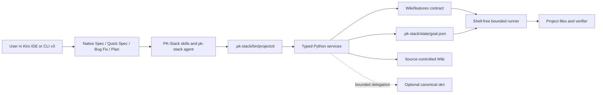
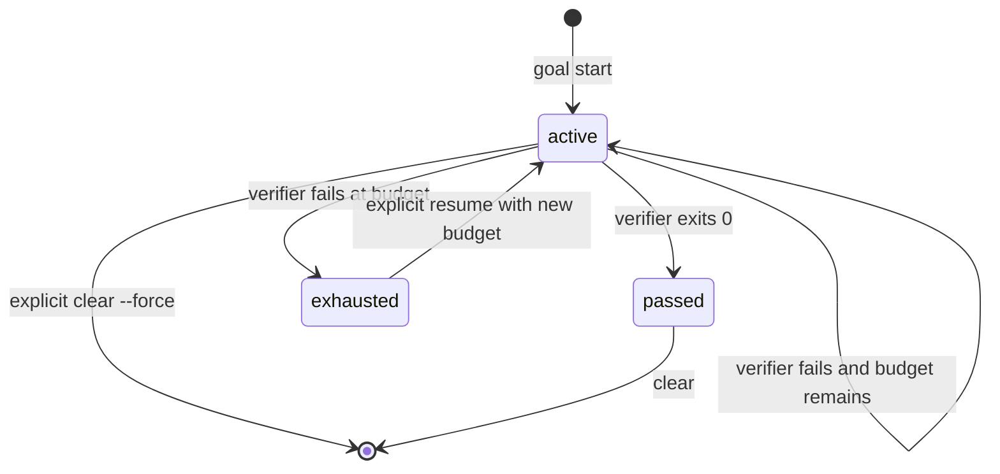

# Architecture

PK-Stack is a Kiro Power plus a small repository-local control plane. The
package's release metadata authority is
[`plugin.json`](../plugin.json). This document describes runtime boundaries,
not release acceptance. See the [validation report](validation-report.md) and
[current release status](../../../reviews/release-status.md) for evidence.

## Boundary and ownership

The design has one simple rule:

> Kiro owns planning and execution. PK-Stack owns workflow semantics.
> `projectctl` owns deterministic project operations and executable evidence.
> The Wiki and optional canonical `okn` own broader project knowledge.

| Surface | Owns | Does not own |
| --- | --- | --- |
| Kiro IDE/CLI | Native Spec, Quick Spec, Bug Fix, Plan, tools, model, permissions, and task execution | PK-Stack goal state or feature proof |
| PK-Stack skills | Prompts, workflow sequencing, and current-session handoff | A replacement agent runtime or native planner |
| `.pk-stack/bin/projectctl` | Setup receipt, discovery, feature records, evidence, goals, and bounded command execution | Kiro orchestration or semantic correctness of arbitrary scripts |
| `Wiki/features/*.md` | User-visible contracts and one executable verifier per contract | Broad architecture context or permanent correctness |
| `Wiki/` and canonical `okn` | Source-controlled knowledge and optional bounded retrieval | A second feature-verification authority |

The normal path is Kiro CLI v3 or the Kiro IDE agent panel. Crew may orchestrate
Kiro; Web may consume committed assets. Neither changes the local primary
boundary. PK-Stack does not launch an external ACP host, invoke `kiro-cli acp`,
or claim that CLI v3 supplies native `/goal`.

## Component map

For a browsable version with guided views, theme switching, zoom, and export,
open the [interactive PK-Stack architecture artifact](artifacts/pk-stack-architecture.html).
Its [Archify source specification](artifacts/pk-stack-architecture.json) is
committed beside it so the diagram can be reviewed and regenerated.



The Python package parses explicit inputs, validates data, runs the stored
verifier, and persists small, inspectable records. It does not call a model.

## Native planning handoff

Kiro owns requirements or bug analysis, `design.md`, `tasks.md`, dependency
waves, and native task execution. In CLI v3, the user starts or resumes a
native plan with `/spec new <name>` or `/spec <name>`, then explicitly swaps to
`pk-stack`. In the IDE, the user selects **Build with spec** or the workflow
picker, then reselects `pk-stack` in the same conversation.

PK-Stack does not emulate those workflows from an Agent Skill or create a
second task graph. `goal bind-spec` writes a small bridge to an executable
command or a published feature and records snapshots of the native intent, design, and
bridge. `tasks.md` remains mutable so Kiro can track work. A task checkbox or
prose acceptance criterion is not executable proof.

## Distribution and generated workspace

The Power source contains:

```text
powers/pk-stack/
├── plugin.json                       # release version authority
├── skills/                            # Power-local workflows
├── dev.kiro/steering/                 # shipped steering
├── src/pk_stack/                    # projectctl package and bootstrap
├── templates/project/.kiro/            # agent and hook templates
├── templates/projectctl/uv.lock       # cached-runtime lock
└── docs/                              # usage, architecture, provenance, evidence
```

The wheel force-includes skills, steering, templates, and the repo-local lock
under `pk_stack/_assets/`, so setup can use a source checkout or an
installed Power. The Power-local `skills/setup-pk-stack/scripts/setup_pk_stack.py`
is the only setup and upgrade authority.

A successful target setup contains:

```text
<project>/
├── .kiro/                              # generated agents, hooks, skills, steering
├── .pk-stack/
│   ├── bin/projectctl                  # stable project entrypoint
│   ├── bootstrap.json                  # managed-file receipt
│   ├── discovery.json                  # root-relative repository inventory
│   ├── projectctl/                     # Python source, lock, and integrity manifests
│   └── state/                          # ignored goal and evidence state
└── Wiki/features/                      # project-owned contracts
```

`.kiro/` and `.pk-stack/` are generated workspace material, not alternate Power
sources. A root `projectctl` convenience wrapper may exist when its name was
unowned, but skills never select it.

The controller cache contains no second copy of skills, steering, or templates.
Doctor checks installed `.kiro/` files against the ownership receipt and curated
bundle manifests. Archify executes its installed `.kiro/skills/archify/` resources.

### Bootstrap receipt and upgrades

The receipt stores the manager, schema, and SHA-256 for every managed path.
Setup performs a complete no-write preflight before applying any change:

| Existing state | Result |
| --- | --- |
| Path absent | `created` |
| Path equals desired bytes | `unchanged` |
| Path still equals its old receipt but Power bytes changed | `pending_updates` |
| Path differs from both old receipt and desired bytes | `conflicts` |
| Retired receipt-owned path still exists | `stale_managed` |
| Symlink or wrong filesystem type | fail closed |

An explicit `--update-managed` is required for pending changes, and only a
path that still matches its old receipt can be replaced. Setup never prunes
stale files or overwrites user content. A project-directory lock serializes
preflight, writes, rehashing, and receipt commit. Writes use temporary files,
`fsync`, and atomic replacement; the final receipt is committed only after
all managed files are rehashed.

The internal wrapper runs `uv sync --locked --no-config` against the cached
project and then executes its venv Python directly. It sets
`PYTHONPATH` only for the controller, strips controller markers before a
verifier run, and keeps the runtime lock and cache inside receipt ownership.
The verifier inherits the caller's project environment, not the control-plane
environment.

## Service boundaries

| Module | Responsibility |
| --- | --- |
| `bootstrap.py` | Two-phase ownership-aware materialization |
| `discovery.py` | Deterministic read-only repository inventory |
| `doctor.py` | Receipt, runtime, Kiro asset, feature, ignore, and goal checks |
| `features.py` | Contract generation, loading, validation, migration, and publication |
| `evidence.py` | Bounded JSONL decision/evidence records and audit |
| `goal.py` | One-goal state machine, locking, snapshots, and attempt history |
| `runner.py` | `shell=False` process launch, hazard screen, timeout, and bounded output |
| `upstreams.py` | Pinned source reproof, parity, and transactional acceptance |
| `knowledge.py` | Optional bounded subprocess boundary to canonical `okn` |
| `paths.py` | Workspace containment and symlink-component checks |

The Cyclopts `cli.py` adapter maps these services to text or JSON and stable
exit codes. It does not contain a second implementation of domain behavior.

## Feature contracts: PROVE

A schema-2 feature record in `Wiki/features/` describes the behavior from the
user's point of view, the expected path, one or more entrypoints and driving
recipes, observable proof, gotchas, and evidence/cleanup boundaries. A ready
record stores an explicit command. `feature validate` checks structure, paths,
links, duplicate slugs, and command policy without running it.

`feature generate --ready` builds and parses the candidate before running its
command, repeats validation immediately before the atomic write, and writes
`draft: false` only on a passing proof. A failed proof leaves a new target
absent and an existing target unchanged. `feature publish` proves a draft
before changing only its draft marker. Every feature mutation uses a lock and
compares exact bytes around proof to detect a concurrent edit.

Commands execute as argv with `shell=False`; shell syntax is not interpreted.
The runner rejects direct shell interpreters, obvious placeholders,
destructive patterns, and known path escapes. It supports explicit project
test/build commands and a narrow `uv run` grammar. This is an evidence and
hazard screen, not a sandbox or proof that an arbitrary script is relevant.

## Goal state and current-session loop

There is one goal slot per project at `.pk-stack/state/goal.json`. Schema 2
stores an objective, one immutable command contract, provenance, a digest,
attempt budget, last result, and append-only attempt history. Spec contracts
also snapshot intent, design, and the bridge; `tasks.md` is intentionally not
snapshotted.



Only one verifier runs at a time. Before and after a run, the service checks
the contract and relevant spec snapshots; a concurrent change discards the
result. A passed goal cannot resume. An exhausted goal needs an explicit
larger budget, capped at 20. The state file is mode `0600` and ignored by the
target's managed `.gitignore` block.

`/verified-goal` keeps the loop in the current Kiro agent session: inspect the
contract, make one bounded change, run one verifier, diagnose, and repeat only
while status is `active`. It reports completion only when stored status is
`passed`; model or reviewer prose cannot substitute for that result.

## Knowledge: KNOW

The source-controlled Wiki is the broad project-knowledge layer. The feature
map is always checked first; explicit `related` links guide targeted expansion.
When installed, canonical `okn` receives bounded `validate Wiki` and `search
Wiki <query>` requests. Without it, status reports `feature-map-only`, broad
search fails, and `knowledge validate --require-okn` fails. Native Kiro
`/knowledge` may index the same files but is not the canonical checker.

PK-Stack does not vendor a second OKF graph, validator, or broad-search
runtime. The provenance docs record the versioned external inputs and their
dispositions. Imported source, parity files, patches, and review output are
untrusted data at every boundary.

## Upstream maintenance

`upstream check` re-proves each configured source's immutable commit/tree
identity, bounded fast-forward history, source-scoped path inventory, and
review disposition. Network access is restricted to the configured GitHub API;
responses and patches are bounded and never executed. One acceptance proposal
can advance one source. The ledger and provenance markers are append-only and
must remain contiguous.

The Power-local source, generated workspace, and review ledger are checked
together before an acceptance operation. This keeps source parity and
generated parity separate from release acceptance: an accepted upstream pin
does not establish release acceptance.

## Security and limits

- Kiro permissions are the interactive authorization boundary; the runner is
  not an OS sandbox.
- Project-owned scripts can still write files, use available credentials, or
  access the network. Review commands before approval.
- SHA-256 receipts detect drift but are not signatures against a writer who
  can edit both content and receipt.
- Existing symlink components, stale managed files, invalid state, and missing
  required Power assets fail closed rather than being repaired silently.
- There is one goal slot, no automatic uninstaller, and no automatic stale-file
  deletion.
- The Web path and a separate IDE GUI end-to-end campaign are untested; Crew
  is optional and may use ACP internally.

The Floci document-export application and live campaigns are maintained in the
separate private [pk-stack-floci-lab](https://github.com/njs14/pk-stack-floci-lab)
repository. It is a consumer of this Power, not a component or release gate
of this repository.

## Related docs

- [Usage and recovery](usage.md)
- [Kiro surface compatibility](kiro-v3-compatibility.md)
- [Upstream skill parity](upstream-skill-parity.md)
- [Porting provenance](provenance.md)
- [Validation report](validation-report.md)
- [Current release status](../../../reviews/release-status.md)
