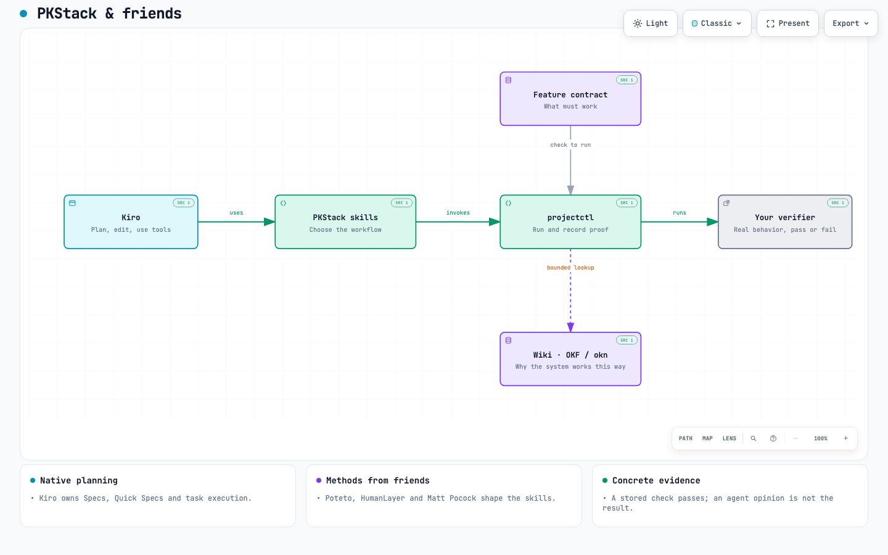
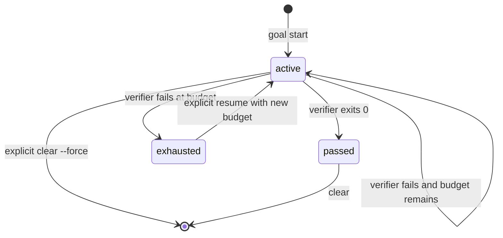

# Architecture

PKStack is a Kiro Power plus a small repository-local control plane. The
package's release metadata authority is
[`plugin.json`](../plugin.json). This document describes runtime boundaries,
not release acceptance. See the [validation report](validation-report.md) and
[current release status](../../../Wiki/knowledge/pkstack/release-record.md) for evidence.

## Boundary and ownership

Kiro plans and executes tasks. PKStack skills guide the workflow, and
`projectctl` records contracts and verifier results. Durable project documents
live in the Wiki. Kiro retrieves bounded context from them; `projectctl`
validates local metadata, links, and returned evidence.

| Surface | Owns | Does not own |
| --- | --- | --- |
| Kiro IDE/CLI | Native Spec, Quick Spec, Bug Fix, Plan, tools, model, permissions, and task execution | PKStack goal state or feature proof |
| PKStack skills | Workflow instructions, sequencing, and current-session handoff | A replacement agent runtime or native planner |
| `.pkstack/bin/projectctl` | Setup receipt, discovery, feature records, evidence, goals, and bounded command execution | Kiro orchestration or semantic correctness of arbitrary scripts |
| `Wiki/features/*.md` | User-visible contracts and one executable verifier per contract | Broad architecture context or permanent correctness |
| `Wiki/knowledge/`, `Wiki/features/`, and native specs | Authoritative source files for bounded Kiro ACP retrieval | A second feature-verification authority |

The normal path is Kiro CLI v3 or the Kiro IDE agent panel. Crew may orchestrate
Kiro; Web may consume committed assets. Neither changes the local primary
boundary. Only `projectctl knowledge search` starts an isolated read-only ACP
worker; it does not replace interactive planning or execution. PKStack does
not claim that CLI v3 supplies native `/goal`.

## Component map



For a browsable version with theme switching, zoom, and export,
open the [interactive PKStack architecture artifact](artifacts/pkstack-architecture.html).
Its [Archify source specification](artifacts/pkstack-architecture.json) is
committed beside it so the diagram can be reviewed and regenerated. The
artifacts show retained knowledge, native Specs, bounded ACP retrieval, and
local validation. The [artifact guide](artifacts/README.md) and
[delivery receipt](https://github.com/njs14/pkstack/blob/9bb1cbbb52552f95f7ccc61e14c44283e526c80d/reviews/release-040-diagrams.json) record their
source identities and visual verification scope.

The Python package parses explicit inputs, validates data, runs the stored
verifier, and persists small, inspectable records. Knowledge search delegates
retrieval to Kiro through ACP; local validation does not call a model.

## Native planning handoff

Native Specs own requirements or bug analysis, `design.md`, `tasks.md`, dependency
waves, and native task execution. In CLI v3, the user starts or resumes a
native plan with `/spec new <name>` or `/spec <name>`, then explicitly swaps to
`pkstack`. In the IDE, the user selects **Build with spec** or the workflow
picker, then reselects `pkstack` in the same conversation.

Conversational Plan uses `/plan <request>` in CLI or the IDE Plan picker. It
keeps its plan in the conversation, without a required `tasks.md`. PKStack
planning shares the `grilling` interview method and carries settled answers into
the native workflow with an explicit request to read that skill. Plan remains
read-only; knowledge capture stays pending until approval and permitted writes.
The [planning guide](usage.md#plan-and-bind-work) describes that checkpoint,
explicit no-write precedence, and the separate standalone interview scope.

PKStack does not emulate those workflows from an Agent Skill or create a
second task graph. `goal bind-spec` writes a small bridge to an executable
command or a published feature and records snapshots of the native intent, design, and
bridge. `tasks.md` remains mutable so Kiro can track work. A task checkbox or
prose acceptance criterion is not executable proof.

## Saved requests and workflow ownership

Native saved prompts are an optional entry layer: they preserve a request the
user chooses to submit. Skills define reusable workflow instructions; agent
profiles configure the working context; steering supplies persistent project
guidance. Native Specs retain planning provenance, and `projectctl` retains the
executable predicate and its results. Saving or expanding a prompt does not
change those authorities.

User-created workspace prompts in `.kiro/prompts/` remain outside PKStack's
managed-file receipt. This lets users customize them through Kiro without
turning normal prompt edits into setup conflicts. A saved request should name
the relevant skill and supply task context, not duplicate its instructions,
choose a model, change permissions, or introduce another execution loop.

PKStack adds no prompt renderer, argument-substitution layer, or MCP dependency
for this purpose. See [saved requests in usage](usage.md#save-a-recurring-request-in-kiro)
for the documented CLI interface and its current verification limits.

## Distribution and generated workspace

The Power source contains:

```text
powers/pkstack/
├── plugin.json                       # release version authority
├── skills/                            # Power-local workflows
├── dev.kiro/steering/                 # shipped steering
├── src/pkstack/                       # projectctl package and bootstrap
├── templates/project/.kiro/            # agent and hook templates
├── templates/projectctl/uv.lock       # cached-runtime lock
└── docs/                              # usage, architecture, provenance, evidence
```

Install the Power from a reviewed source folder or extracted release archive.
The Power-local `skills/pkstack-setup/scripts/setup_pkstack.py` is the setup
and refresh entrypoint. PKStack ships no standalone package commands or
asset-bearing wheel. The internal controller retains `setup --power-root` for
trusted maintenance verification, which must execute reviewed base code against
an explicit Power source.

A successful target setup contains:

```text
<project>/
├── .kiro/                              # generated agents, hooks, skills, steering
├── .pkstack/
│   ├── bin/projectctl                  # stable project entrypoint
│   ├── bootstrap.json                  # managed-file receipt
│   ├── discovery.json                  # root-relative repository inventory
│   ├── projectctl/                     # Python source, lock, and integrity manifests
│   └── state/                          # ignored goal and evidence state
└── Wiki/
    ├── features/                      # project-owned contracts
    ├── knowledge/                     # durable topic documents
    └── work/                          # ignored task-local material
```

`.kiro/` and `.pkstack/` are generated workspace material, not alternate Power
sources. Setup creates only `.pkstack/bin/projectctl`; a root `projectctl`
belongs to the host project and is preserved.

The controller cache contains no second copy of skills, steering, or templates.
Doctor checks installed `.kiro/` files against the ownership receipt and curated
bundle manifests. Archify executes its installed `.kiro/skills/archify/` resources.

### Bootstrap receipt and upgrades

The schema-2 receipt stores the manager and SHA-256 for every managed path.
Wiki navigation seeds become user-owned when created. Schema-1 receipts are
refused before writes; use the [clean reinstall procedure](usage.md#clean-reinstall)
to preserve project content and historical evidence.
Setup performs a complete no-write preflight before applying any change:

| Existing state | Result |
| --- | --- |
| Path absent | `created` |
| Path equals desired bytes | `unchanged` |
| Path still equals its old receipt but Power bytes changed | `pending_updates` |
| Path differs from both old receipt and desired bytes | `conflicts` |
| Retired receipt-owned path still exists | `stale_managed` |
| Symlink or wrong filesystem type | fail closed |
| Legacy managed installation | stop before writes; require reviewed clean reinstall |

An explicit `--update-managed` is required for pending changes, and only a
path that still matches its old receipt can be replaced. Setup never prunes
stale files or overwrites user content. A project-directory lock serializes
preflight, writes, rehashing, and receipt commit. Writes use temporary files,
`fsync`, and atomic replacement; the final receipt is committed only after
all managed files are rehashed.

The internal wrapper runs `uv sync --locked --no-config` against the cached
project and then executes its venv Python directly. It sets
`PYTHONPATH` only for the controller, strips controller markers before a
verifier run, and keeps the runtime lock and cache inside receipt ownership.
The verifier inherits the caller's project environment, not the control-plane
environment.

## Service boundaries

| Module | Responsibility |
| --- | --- |
| `bootstrap.py` | Two-phase ownership-aware materialization |
| `discovery.py` | Deterministic read-only repository inventory |
| `doctor.py` | Receipt, runtime, Kiro asset, feature, ignore, and goal checks |
| `features.py` | Contract generation, loading, validation, and publication |
| `evidence.py` | Bounded JSONL decision/evidence records and audit |
| `goal.py` | One-goal state machine, locking, snapshots, and attempt history |
| `runner.py` | `shell=False` process launch, hazard screen, timeout, and bounded output |
| `upstreams.py` | Pinned source reproof, parity, and transactional acceptance |
| `knowledge.py` and `knowledge_links.py` | Local metadata/link validation, feature composition, and knowledge command routing |
| `knowledge_acp.py` and `knowledge_runtime_bridge.py` | Bounded Kiro ACP retrieval with an isolated runtime boundary |
| `knowledge_payload.py` | Corpus bounds and host verification of exact source evidence |
| `paths.py` | Workspace containment and symlink-component checks |

The Cyclopts `cli.py` adapter maps these services to text or JSON and stable
exit codes. It does not contain a second implementation of domain behavior.

## Feature contracts: PROVE

A schema-2 feature record in `Wiki/features/` describes the behavior from the
user's point of view, the expected path, one or more entrypoints and driving
recipes, observable proof, gotchas, and evidence/cleanup boundaries. A ready
record stores an explicit command. `feature validate` checks structure, paths,
links, duplicate slugs, and command policy without running it.

`feature generate --ready` builds and parses the candidate before running its
command, repeats validation immediately before the atomic write, and writes
`draft: false` only on a passing proof. A failed proof leaves a new target
absent and an existing target unchanged. `feature publish` proves a draft
before changing only its draft marker. Every feature mutation uses a lock and
compares exact bytes around proof to detect a concurrent edit.

Commands execute as argv with `shell=False`; shell syntax is not interpreted.
The runner rejects direct shell interpreters, obvious placeholders,
destructive patterns, and known path escapes. It supports explicit project
test/build commands and a narrow `uv run` grammar. This is an evidence and
hazard screen, not a sandbox or proof that an arbitrary script is relevant.

## Goal state and current-session loop

There is one goal slot per project at `.pkstack/state/goal.json`. Schema 2
stores an objective, one immutable command contract, provenance, a digest,
attempt budget, last result, and append-only attempt history. Spec contracts
also snapshot intent, design, and the bridge; `tasks.md` is intentionally not
snapshotted.



Only one verifier runs at a time. Before and after a run, the service checks
the contract and relevant spec snapshots; a concurrent change discards the
result. A passed goal cannot resume. An exhausted goal needs an explicit
larger budget, capped at 20. The state file is mode `0600` and ignored by the
target's managed `.gitignore` block.

`/pkstack-verified-goal` keeps the loop in the current Kiro agent session: inspect the
contract, make one bounded change, run one verifier, diagnose, and repeat only
while status is `active`. It reports completion only when stored status is
`passed`; model or reviewer prose cannot substitute for that result.

## Knowledge: KNOW

The source-controlled Wiki is the broad project-knowledge layer. The feature
map is checked first; explicit `related` links guide targeted expansion.
`knowledge search` starts an isolated read-only Kiro ACP worker over
`Wiki/knowledge/`, `Wiki/features/`, and `.kiro/specs/`. `Wiki/work/`, native
instructions, and skill packages are excluded. Native specs are read in place
and remain authoritative.

The adapter uses the official Python `agent-client-protocol==0.12.1` package
and native Kiro CLI authentication. Its version-specific isolation bridge
currently supports POSIX, Kiro CLI 2.21.1, and embedded KAS 0.58.7. Unsupported
runtimes fail explicitly. Model selection defaults to `auto`; its resolved
model is unknown, and an unavailable selection never silently falls back.

The worker returns a strict JSON answer and exact source quotes. The host
verifies unique source substrings, adds line ranges and SHA-256 provenance,
and rejects changed corpus bytes, excluded sources, invalid shapes, excessive
context, or an incomplete result. At most one bounded correction is allowed.
The public result uses `schemaVersion: "2"` and `mode: "kiro-acp"`. Its context
budget estimates UTF-8 JSON bytes divided by four; internal model token use is
unreported. Retrieval returns bounded source passages and checks their provenance;
[knowledge usage](usage.md#use-project-knowledge) describes the limits.

`knowledge validate` is deterministic and local. It composes existing feature
validation with minimal authoring metadata and CommonMark local link/image
checks, including reference links and Markdown heading anchors. It preserves
unknown metadata and does not fetch external links or claim full OKF
conformance, raw HTML ID/footnote/plugin fragment support, or graph semantics.
`knowledge status` reports layout and `cli_compatible`. Its no-model probe
leaves `isolation_verified` and `search_verified` false; CLI compatibility alone
does not prove authenticated retrieval. Validation works without retrieval. The old optional `okn` backend is retired.

The independent Google OKF specification and OKF skills methodology remain
tracked inputs. The retired OpenKnowledge CLI contract retains archived
provenance and its paired maintenance manifest/ledger history. Imported
source, parity files, patches, retrieved documents, and review output remain
untrusted data. See the [runtime decision](../../../Wiki/knowledge/pkstack/native-spec-and-okn.md)
for the superseded choice and its rationale.

## Upstream maintenance

`upstream check` re-proves each configured source's immutable commit/tree
identity, bounded fast-forward history, source-scoped path inventory, and
review disposition. Network access is restricted to the configured GitHub API;
responses and patches are bounded and never executed. One acceptance proposal
can advance one source. The ledger and provenance markers are append-only and
must remain contiguous.

The Power-local source, generated workspace, and review ledger are checked
together before an acceptance operation. This keeps source parity and
generated parity separate from release acceptance: an accepted upstream pin
does not establish release acceptance.

## Security and limits

- Kiro permissions are the interactive authorization boundary; the runner is
  not an OS sandbox.
- Project-owned scripts can still write files, use available credentials, or
  access the network. Review commands before approval.
- SHA-256 receipts detect drift but are not signatures against a writer who
  can edit both content and receipt.
- Existing symlink components, stale managed files, invalid state, and missing
  required Power assets fail closed rather than being repaired silently.
- There is one goal slot, no automatic uninstaller, and no automatic stale-file
  deletion.
- The [dated compatibility evidence](kiro-v3-compatibility.md#support-and-evidence-matrix)
  records bounded IDE import/setup and CLI/IDE Standard and Quick Spec repair
  campaigns. These observations do not prove a later candidate. Web end-to-end
  use remains untested; Crew is optional and may use ACP internally.

The Floci document-export application and live campaigns are maintained in the
separate private [pk-stack-floci-lab](https://github.com/njs14/pk-stack-floci-lab)
repository. It is a consumer of this Power, not a component or release gate
of this repository.

## Related docs

- [Usage and recovery](usage.md)
- [Kiro surface compatibility](kiro-v3-compatibility.md)
- [Upstream skill parity](upstream-skill-parity.md)
- [Porting provenance](provenance.md)
- [Validation report](validation-report.md)
- [Current release status](../../../Wiki/knowledge/pkstack/release-record.md)
