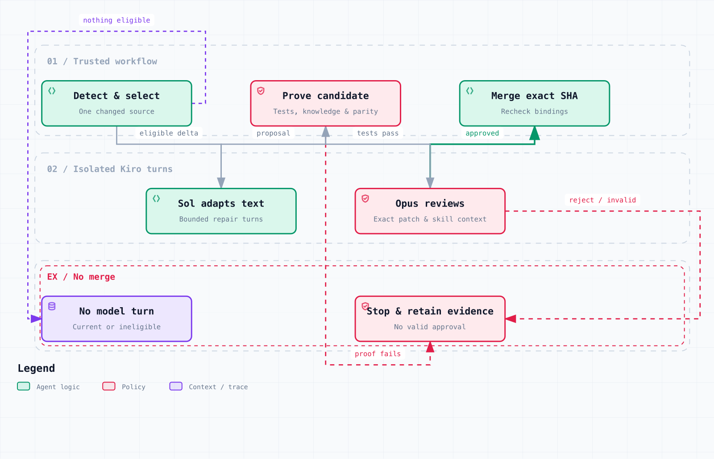

# Maintaining PKStack upstream ports

The configured schedule is daily at 13:17 UTC. When enabled, a change to an
imported subtree can start one bounded Kiro repair and review cycle. The
[release status](../../../reviews/release-status.md) records activation and
live validation results, separately from this workflow's design. Ordinary
Kiro CLI and IDE sessions do not depend on the pipeline.

## What can ship automatically



The updater can adapt existing skill and documentation text within the paths allowed
by [the maintenance policy](../../../.github/pkstack-maintenance-policy.json). It
cannot edit executable helpers, controller code, tests, dependencies, permissions,
or workflow controls. Those changes require a maintainer.

1. The detector proves each pinned source and compares its imported subtree with
   the remote revision. A repository commit outside that subtree is informational:
   it does not advance a pin, fail parity, or spend model credits.
2. The controller selects one changed source that has review budget remaining.
   Its immutable plan is the sole source-selection authority for the model,
   acceptance proposal, and candidate tests.
3. Kiro receives the selected source evidence, the latest validated peer findings
   for that content, and within-run verifier feedback. It has up to four repair
   turns after the initial failing verification. Candidate code never receives
   the Kiro credential or a GitHub write token.
4. Secretless tests prove the selected source acceptance and generated parity.
   Other drifting sources remain deferred; their pins, review histories, and
   provenance must remain unchanged. Unrelated remote drift does not block the
   selected candidate.
5. Trusted candidate preparation validates source acceptance and builds the exact
   review bundle. Base tests run independently; candidate tests and the isolated
   Kiro-hosted reviewer then run concurrently. The test runner has no review
   credential. Only a valid
   `approved` verdict with no material findings can reach the exact-SHA merge.
   GitHub App signals are advisory; the pipeline needs no separate provider API
   key or GitHub Copilot subscription.

For the selected source's parity artifact, `source.retrieved_on` records the UTC
date of the latest inventory retrieval, not the initial baseline date. The trusted
detector job captures that date and fails if retrieval crosses midnight UTC; the
maintainer receives it as `inventory_retrieved_on`. It must not infer the date from
candidate content or its own clock. Existing safety rationale stays verbatim when
the handling decision and prerequisites are unchanged; delta-specific explanations
belong in the new proposal and provenance prose. The new final provenance marker
ends with an LF newline. Genesis and accepted review history remain unchanged.

The configured model identities and spending bounds live in the workflow policy
and inventory validator. Model identity, required capabilities, minimum context,
and maximum price are checked; changes to provider marketing descriptions are not
grounds for blocking a run. Requested effort is not independently attested by
Kiro's stream metadata.

The autonomous candidate gate starts through `workflow_run` and owns the
update's test, review, and merge decision. GitHub also queues ordinary PR CI
for a PR created with `GITHUB_TOKEN`, but requires a human to approve those
additional runs. Unapproved runs can expire without executing any job. This
does not replace or unblock the candidate gate. PKStack does not add a PAT,
another GitHub App credential, or automatic workflow approval to avoid that
GitHub restriction. See [GitHub's token documentation](https://docs.github.com/en/actions/concepts/security/github_token).

## Reviewer feedback and credit limits

Skill changes also receive a compatibility review. The versioned review bundle
contains the exact candidate's skill catalog, affected instructions, relevant
neighbor skills, and shared steering. Realistic prompts and forbidden effects
come from the protected test fixture on the trusted base, never the candidate.
Changed references are included; other reference paths are an inventory, not
reviewed bodies. The whole bundle is digest-bound to the tested base and head.

The reviewer checks ownership, outputs, permissions, and duplicated mandatory
work. Shared vocabulary and useful composition are allowed. For example,
`show-me` explains something visually, while `show-me-your-work` records work
and evidence. Asking to see completed work does not authorize a new log.

This context has a hard 64 KiB limit. Missing base scenarios, uncovered new
skills, malformed context, or an overlarge bundle stop automation for manual
review. Tests check the fixture, links, catalog, and bundle integrity; they do
not claim to prove how every model will route every natural-language request.
The existing Kiro-hosted Opus reviewer performs that bounded semantic review.
No extra model job, provider key, or permission is added.

[`maintenance/upstream-feedback.json`](../../../maintenance/upstream-feedback.json)
contains one latest validated rejection report and count per source, not an
append-only history. Reports bind the source commit and subtree, source and candidate
run IDs, tested base/head, and review-content digests. A new subtree starts a new
budget. A later repository commit with identical imported content does not.

Three substantive peer-review rejections exhaust that source/content budget.
Infra failures, malformed output, and unauthenticated reports do not consume it.
An early rejection is recorded only after candidate tests pass, preserving the
previous spending rule when review and test failures occur together. Cleanup waits
for every test/review job; it cannot close an actively tested candidate.
Exhausted sources are skipped so other changed sources can proceed. The latest
findings accompany the next eligible attempt.

Only immutable base code publishes feedback. Its secretless job changes exactly
the feedback file through a non-forced, compare-and-swap Git branch update. It
rejects stale reports, conflicting reruns, missing/invalid history, and concurrent
main-branch movement. Candidate/model jobs cannot edit this ledger. Sanitized
reports are retained as workflow artifacts for 30 days; raw model streams and
credentials are never published. Artifact expiry does not reset the durable count.

## When automation stops

- A fresh active candidate suppresses another run. Any stale, terminal, or missing
  candidate run that leaves its PR open requires operator recovery. The next
  cadence will not close it and silently discard potentially unrecorded findings.
- A material rejection with passing candidate tests is recorded before authenticated
  in-run cleanup closes its PR. Failed report publication or a failed feedback write
  leaves the PR open. If candidate tests fail too, cleanup closes the failed candidate
  without spending a substantive-rejection count.
- A generated-only parity mismatch produces `manual-parity`, with no model call.
  Run setup from reviewed Power source, inspect the generated diff, and run the
  deterministic tests. An LLM is not needed to regenerate known outputs.
- Source code, security-policy, executable, or dependency changes remain outside
  the automated text-maintenance boundary.

For an interrupted rejection, inspect the exact candidate run and reconcile its
validated report into the durable ledger before closing the candidate PR. If the
report or authority cannot be recovered, leave it blocked for manual resolution;
do not delete the ledger or reset its count to make the job green.

## Explicit retry after three rejections

First inspect the latest report and address the reason repeated attempts failed.
Then dispatch the maintenance workflow with `retry_source` equal to the exact
`source-id@current-subtree-sha` from the detector. From the repository:

```bash
gh workflow run pk-stack-upstream-maintenance-kiro.yml \
  -f retry_source='SOURCE_ID@40_CHARACTER_CURRENT_SUBTREE_SHA'
```

This override is accepted only for a currently drifting source whose exact subtree
has reached three rejections. It selects that source and authorizes a renewed
three-rejection budget. Wrong/stale subtree IDs, non-exhausted sources, and generic
retry requests fail closed. A retried rejection becomes count one; prior findings
remain available to that attempt.

The workflow filename deliberately retains its original spelling to preserve
its GitHub Actions identity. It is an internal operational identifier, not a
Power or skill name. The retry command does not change whether the workflow
is enabled; re-enabling a paused schedule requires the owner's approval.

## Local checks without model calls

```bash
python3 -B -m unittest discover -s .github/scripts -p 'test_*.py'
node --test .github/scripts/test_pkstack_pr_policy.js
actionlint .github/workflows/*.yml
shellcheck .github/scripts/*.sh
uv run --project powers/pkstack --frozen pytest \
  powers/pkstack/tests/test_upstreams.py \
  powers/pkstack/tests/test_release_metadata.py -q
```

These cover controller decisions, content-only drift, serialization, feedback
budgets, report validation, shell preflight, candidate identity, and release
metadata. They do not prove live Kiro availability, GitHub App installation,
repository permissions, artifact transport, or the final GitHub merge API.
