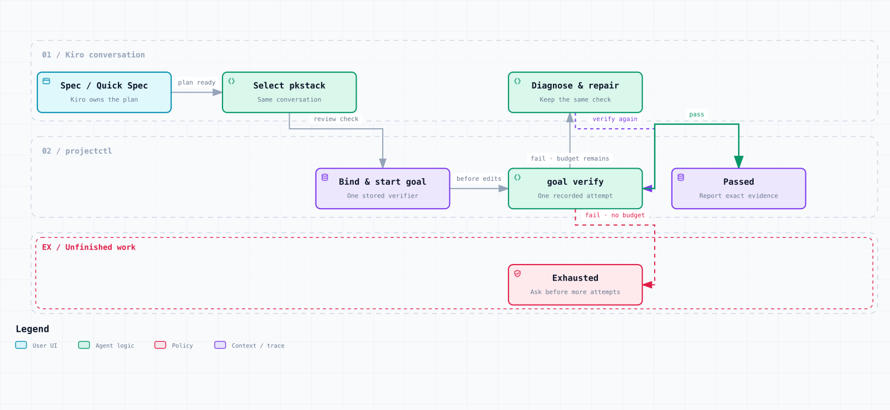

# Usage

PKStack adds a repeatable finish to Kiro development: store the command that
checks a task, record the initial failure, repair in the current Kiro session,
and retain the passing result. Project knowledge stays in the repository for
later sessions. This guide works for CLI-only users and IDE users.

## Prerequisites

- Kiro CLI with v3 support or Kiro IDE, installed and signed in;
- [`uv`](https://docs.astral.sh/uv/) on `PATH`;
- a `python3` launcher; and
- access to the PKStack Power source and a project you are allowed to modify.

The locked controller runtime requires Python 3.11+. The setup launcher can
also start under the tested macOS Python 3.9 path and delegate to `uv`, which resolves
a supported runtime. You do not need to replace macOS system Python. Initial
setup may need network access to download Python and locked dependencies;
[uv documents automatic Python acquisition](https://docs.astral.sh/uv/guides/install-python/).
If runtime acquisition fails, resolve that prerequisite before continuing.

Check the terminal tools:

```sh
uv --version
python3 --version
```

For the CLI path, also check:

```sh
kiro-cli --version
kiro-cli chat --v3 --help
```

PKStack inherits the model and effort selected in Kiro. It does not store a
model choice in `projectctl` or require a particular provider for interactive
work. Historical acceptance model choices describe those runs, not a default.

## Choose the Power source

The **source** is the reviewed Power containing the installer. The **target** is
your application, which will receive `.kiro/`, `.pkstack/`, and Wiki assets.
Keep the source available for later managed updates.

If you have not cloned PKStack, run:

```sh
git clone https://github.com/njs14/pkstack.git
cd pkstack
```

From the root of that checkout, capture the absolute Power path:

```sh
export PKSTACK_POWER="$PWD/powers/pkstack"
test -f "$PKSTACK_POWER/plugin.json"
test -f "$PKSTACK_POWER/skills/pkstack-setup/scripts/setup_pkstack.py"
```

For an unpacked standalone Power instead, open a terminal in the folder that
contains `plugin.json` and capture that folder:

```sh
export PKSTACK_POWER="$PWD"
test -f "$PKSTACK_POWER/plugin.json"
test -f "$PKSTACK_POWER/skills/pkstack-setup/scripts/setup_pkstack.py"
```

These variables last for this terminal session; restore the source path if you
open another.
Never derive the source from the target's `.pkstack/` cache. Review the Power
before running its setup script or importing it in Kiro.

<a id="import-and-bootstrap"></a>

## Install with Kiro CLI

No IDE import is required. In this same terminal, replace the example path below
with your application's root directory. Capture and check the target before
previewing changes:

```sh
cd "/absolute/path/to/your/project"
export PKSTACK_PROJECT="$PWD"
: "${PKSTACK_POWER:?Capture the reviewed Power source path first}"
printf 'Source: %s\nTarget: %s\n' "$PKSTACK_POWER" "$PKSTACK_PROJECT"
```

Confirm the target shown is your application, not the PKStack checkout. To try
PKStack before changing an existing application, use the disposable project in
[the first-task guide](first-task.md) instead.

Preview setup:

```sh
python3 "$PKSTACK_POWER/skills/pkstack-setup/scripts/setup_pkstack.py" \
  --root "$PKSTACK_PROJECT" --dry-run --output json
```

A dry run previews target changes without writing managed target files. It can
still populate runtime caches and acquire dependencies; it is not an offline
or cache-free operation. Review the target path and listed files. Non-empty
`pending_updates`, `stale_managed`, or `conflicts` block setup: inspect them
before proceeding; use the refresh section for an existing installation.

When the preview is acceptable, apply it:

```sh
python3 "$PKSTACK_POWER/skills/pkstack-setup/scripts/setup_pkstack.py" \
  --root "$PKSTACK_PROJECT" --output json
```

From the target root, verify the installation:

```sh
cd "$PKSTACK_PROJECT"
.pkstack/bin/projectctl version --output json
.pkstack/bin/projectctl doctor --output json
.pkstack/bin/projectctl knowledge validate --output json
```

Expect `ok: true` from doctor and knowledge validation. Doctor checks the
installation; knowledge validation checks local metadata and links without a
model. Neither proves that Kiro has repaired your application.

Launch Kiro from the target root:

```sh
kiro-cli chat --v3 --agent pkstack
```

## Install with Kiro IDE

1. Choose **Powers → Add Custom Power → Import power from a folder** and select
   the reviewed Power folder containing `plugin.json`. Review the package and
   choose **Install**.
2. Open your target application in Kiro. In its chat or Agent Focus session,
   invoke `/pkstack-setup`.
3. Review the preview and approve the intended changes. Setup reports doctor
   and local validation results; resolve failures before starting work.
4. Select the workspace `pkstack` agent before the next workflow message.

If the imported Power is not discoverable, use the terminal setup above. If the
new agent or skills are absent, open a fresh chat in the same project and select
`pkstack`; copying files does not attach the new profile retroactively.

## First success

Use `/pkstack <task>` for your own work, or [try one failing task](first-task.md)
with either surface. That example supplies a repeatable verifier and explains
how to inspect the failure, Kiro's repair, and the stored passing result.

Use `.pkstack/bin/projectctl` for project operations. Setup may create a root
`projectctl` convenience wrapper when that name is unowned, but it is not the
trusted entrypoint. The canonical wrapper uses the shipped locked runtime under
`.pkstack/projectctl/`; its environment does not become the verifier's environment.

### Attach the generated agent

The bootstrap conversation may not inherit the new profile. In the IDE choose
the workspace `pkstack` agent. In CLI v3 use either:

```text
/agent swap pkstack
```

or, when Kiro has not discovered the new assets yet:

```sh
kiro-cli chat --v3 --agent pkstack
```

Keep the handoff in the same conversation when possible. The primary profile
asks before ordinary writes and canonical controller commands. Delegated
architect, reviewer, and verifier profiles omit `write` and `shell`; they
inspect and report to the primary session. These Kiro permissions complement
the controller's checks but are not an operating-system sandbox.

## Commands

| Command | Use it for |
| --- | --- |
| `/pkstack` | Route a task through planning, implementation, verification, and review |
| `/pkstack-setup` | Preview installation or refresh when the imported Power is discoverable |
| `/pkstack-maintain` | Review upstream changes to the Power |
| `/pkstack-verified-goal` | Repair against one stored executable check |
| `/pkstack-model-council` | Compare independent reviews and resolve findings |
| `/pkstack-principles` | Apply the engineering-principles catalog |

Imported skills keep their names. The [sources guide](curated-skills.md) explains
their roles and handoffs. For a runnable example, [try one failing task](first-task.md).

## The short version



[Open the interactive workflow](artifacts/pkstack-task-workflow.html).

Kiro CLI v3 and the Kiro IDE agent panel are the primary surfaces. Kiro Crew is
optional. Kiro Web can consume committed workspace assets, but its end-to-end
path has not been tested. The selected IDE and CLI profiles have recorded
command-approval checks; that does not prove every permission rule. Normal work stays
in the current session. Only `projectctl knowledge search` starts an isolated,
read-only Kiro ACP worker for bounded retrieval. PKStack does not claim that
CLI v3 provides Kiro's native `/goal` command.

## Plan and bind work

For nontrivial work, use Kiro's native planner before the PKStack loop:

- CLI v3: `/spec new <name>`, then `/spec <name>` to resume;
- IDE: **Build with spec** or the workflow picker; and
- choose standard Spec for unfamiliar or high-risk work, or Quick Spec for a
  bounded change whose shape is already clear.

Kiro owns requirements or bug analysis, design, tasks, dependency waves, and
native task execution. When those artifacts are ready, return to `pkstack` and
bind the native plan to an executable verifier. For a new, still-failing feature:

```sh
.pkstack/bin/projectctl goal bind-spec account-lookup \
  --command "python3 -m unittest discover -s tests -v" --output json
.pkstack/bin/projectctl goal start "Repair account lookup" \
  --spec account-lookup --max-attempts 4 --output json
.pkstack/bin/projectctl goal verify --output json
```

Record that initial failure before editing, repair in the same Kiro session,
and run `goal verify` again. Publish a reusable feature only when useful and
after its command passes. For an already published feature, bind with
`--feature account-lookup` instead of `--command`. The bridge records native
spec provenance without copying a task graph or treating a checked task as proof.

## Create and prove feature contracts

Feature contracts live in `Wiki/features/`. A schema-2 contract describes the
user behavior, expected path, entrypoints, observable proof, gotchas, and
evidence/cleanup boundaries. Slugs use lowercase letters, digits, and single
hyphens.

Create a draft without running its command:

```sh
.pkstack/bin/projectctl feature generate account-lookup \
  --title "Account lookup" \
  --behavior "A caller can retrieve account status." \
  --expected-path "CLI -> gateway -> account service -> response" \
  --sub-feature "lookup-status=Return the current account status." \
  --entrypoint "cli=Run the account lookup command." \
  --drive "cli=Run the public command from the project root." \
  --entrypoint-proof "cli=Exit zero and print the expected status." \
  --gotcha "A zero exit without the expected status is insufficient." \
  --evidence-boundary "Retain bounded output and exit status." \
  --cleanup-boundary "Remove only verifier-owned temporary state." \
  --command "uv run pytest tests/test_account_lookup.py -q" \
  --output json
```

Add `--ready` to run the command before writing `draft: false`:

```sh
.pkstack/bin/projectctl feature generate account-lookup \
  --title "Account lookup" \
  --behavior "A caller can retrieve account status." \
  --expected-path "CLI -> gateway -> account service -> response" \
  --sub-feature "lookup-status=Return the current account status." \
  --entrypoint "cli=Run the account lookup command." \
  --drive "cli=Run the public account lookup command." \
  --entrypoint-proof "cli=Exit zero and print the expected status." \
  --gotcha "The public command must be exercised." \
  --evidence-boundary "Retain bounded verifier output." \
  --cleanup-boundary "Remove only temporary fixture state." \
  --command "uv run pytest tests/test_account_lookup.py -q" \
  --ready --output json
```

Schema 2 is the only supported format; all its structured fields are required.
A failed proof leaves a new target absent or leaves an
existing target unchanged. `feature validate` checks syntax, links, location,
duplicate slugs, and command policy; it does not prove the behavior:

```sh
.pkstack/bin/projectctl feature show account-lookup --output json
.pkstack/bin/projectctl feature list --output json
.pkstack/bin/projectctl feature validate --output json
```

For one to five features, prepare one JSON plan and prove only the named
representative during generation:

```sh
.pkstack/bin/projectctl feature generate-map feature-plan.json \
  --representative account-lookup --output json
```

The other records remain drafts until each verifier passes. Publish and verify
them separately:

```sh
.pkstack/bin/projectctl feature publish account-lookup --output json
.pkstack/bin/projectctl feature verify account-lookup --output json
```

Aim for the most useful three to five features when the project has that many;
a smaller application can start with one. Rewrite older schema-1 records as
reviewed schema-2 contracts. There is no migration command.

## Run a verified goal

In the selected `pkstack` session:

```text
/pkstack-verified-goal Implement account lookup and make account-lookup pass.
```

The skill inspects one contract, makes a bounded change, runs one verifier,
and repeats only while the stored goal remains `active`. Completion requires
stored status `passed`. Native subagents may help with bounded diagnosis, but
the primary session owns edits and final evidence.

For explicit CLI control, start one goal from exactly one source:

```sh
.pkstack/bin/projectctl goal start \
  "Repair account lookup" \
  --feature account-lookup --max-attempts 4 --output json
```

Or supply one reviewed command:

```sh
.pkstack/bin/projectctl goal start \
  "Repair account lookup" \
  --command "uv run pytest tests/test_account_lookup.py -q" \
  --max-attempts 4 --output json
```

Inspect and verify:

```sh
.pkstack/bin/projectctl goal status --output json
.pkstack/bin/projectctl goal verify --output json
```

| Result | Exit | Stored status |
| --- | ---: | --- |
| Verifier passed | 0 | `passed` |
| Verifier failed with attempts left | 1 | `active` |
| Verifier failed on the final attempt | 1 | `exhausted` |
| Invalid state or command | 2 | unchanged or unavailable |

There is one goal slot per project. A new goal cannot replace an existing
one. An exhausted goal needs an explicit larger budget (`goal resume
--add-attempts 2`); the total maximum is 20. Clear terminal state only after
preserving evidence:

```sh
.pkstack/bin/projectctl goal clear --output json
```

Active state requires the explicit `--force` abandonment option. Clearing
state does not revert project edits. `goal tripwire` is an advisory read and
cannot schedule another turn or mark success.

Ctrl-C or SIGTERM stops the verifier's process group and releases the goal
lock. Cancellation never records a passing result. Inspect `goal status`
before deciding whether to retry.

### Verifier boundary

Commands run as argv with `shell=False`. Pipelines, redirects, substitutions,
direct shell interpreters, obvious placeholders, destructive operations, and
known path escapes are rejected. The policy is an evidence screen, not a
sandbox or a semantic proof checker. A permitted project script can still
write files, access the network, or use credentials available to its process.
Review the displayed command, its project scope, and its output before
approving it. Never put credentials in a contract, objective, or evidence
record.

## Use project knowledge

The feature map is the first context layer. Check the broader integration only
when the feature and its explicit links do not answer the question:

```sh
.pkstack/bin/projectctl knowledge status --output json
.pkstack/bin/projectctl knowledge validate --output json
.pkstack/bin/projectctl knowledge search "account suspension" --budget 1200 --model auto --output json
```

`knowledge status` reports the corpus layout and Kiro retrieval availability.
`knowledge validate` runs locally without Kiro, a model, or `okn`. It composes
feature validation with minimal knowledge metadata and local Markdown links:
a nonempty `type`; nonempty `title` and `description` when present; `tags` as a
list of nonempty strings when present; and optional `okf_version: "0.2"`.
Unknown metadata is preserved. CommonMark inline/reference links and images,
local paths, and Markdown heading anchors are checked. External links are not
fetched; raw HTML IDs, footnotes, plugin-specific fragments, full OKF
conformance, and graph semantics are outside this check.

Search reads `Wiki/knowledge/`, `Wiki/features/`, and `.kiro/specs/`. It excludes
`Wiki/work/` and does not copy native skills or instructions into the corpus.
The worker uses native Kiro CLI authentication and the official Python ACP
client pinned to `agent-client-protocol==0.12.1`. The current adapter supports
POSIX and is gated to Kiro CLI 2.21.1 with embedded KAS 0.58.7; an unsupported
or unavailable runtime fails explicitly while local validation remains usable.
There is no alternate backend or silent model fallback. Optional `--model`
defaults to `auto`; the model resolved by Kiro for `auto` is unknown.

`--budget` caps returned context using UTF-8 JSON bytes divided by four; it does
not cap or measure the worker's internal token use, which is unreported. A
successful search returns `schemaVersion: "2"` and `mode: "kiro-acp"`. The
`context` object contains `answer`, `sources` (each with `path`, `quote`,
`lineStart`, `lineEnd`, and `contentSha256`), `uncertainties`, and `incomplete`.
The host verifies unique exact quotes and an unchanged corpus. Invalid, excluded, over-budget, or incomplete results
are rejected after at most one bounded correction.

The host also limits protocol input before SDK parsing to 1 MiB per frame and
16 MiB per task, including messages that are not returned as context. A prompt
has a 120-second deadline; cancellation sends have a 0.5-second deadline and
brief retries before bounded process-group cleanup. These are execution limits,
separate from the returned-context budget.

Use `/okf` to produce, maintain, or consume durable knowledge. Native Kiro
`/knowledge` may index the same files; project files remain authoritative.
The earlier optional `okn` backend and `--require-okn` flag have been removed.
See the [knowledge runtime decision](../../../Wiki/knowledge/pkstack/native-spec-and-okn.md).

## Refresh managed files

Leave the restricted `pkstack` profile before refreshing. CLI v3 2.21.1 names
its bundled default agent `default`:

```text
/agent swap default
```

This swap does not make an imported Power available. Invoke `/pkstack-setup`
only if it is discovered in that context. Otherwise use the Power-local script
from a terminal. If the dry run reports `pending_updates`, inspect the exact
paths and preview the explicit upgrade:

```sh
python3 "$PKSTACK_POWER/skills/pkstack-setup/scripts/setup_pkstack.py" \
  --root "$PWD" --dry-run --update-managed --output json
```

Review the explicit update preview before applying it:

```sh
python3 "$PKSTACK_POWER/skills/pkstack-setup/scripts/setup_pkstack.py" \
  --root "$PWD" --update-managed --output json
```

After setup, return to the same conversation with `/agent swap pkstack`.
Do not add a cached setup skill to `.kiro/skills/` to force discovery.

`--update-managed` replaces only a path that still matches its prior receipt
hash. It never overwrites a user edit. `stale_managed` paths are not deleted
automatically; preserve or remove each exact path by a separate project
decision. The cached controller's setup command fails unless an explicit,
reviewed `--power-root` is supplied.

The PKStack rename is a clean-install change. Setup blocks legacy managed
installations before writes; it adds no aliases and performs no automatic
migration. Follow the [0.3 upgrade guide](upgrade-0.3.md) for a separate-checkout
transition and rollback. An earlier installation may use a `.pk-stack/bootstrap.json`
receipt and `pk-stack`-named agent files. Those names identify old files to
review, not supported entry points.

Before reinstalling, preserve project-owned `Wiki/` content, native
`.kiro/specs/`, user-authored settings, and any evidence you want to retain.
Inspect the old receipt and compare its hashes with the files on disk. With
explicit approval, remove only the unchanged managed paths and the old receipt
after that comparison. Review retired cache paths individually; never delete
an entire `.kiro/` or Wiki directory. User-modified managed files need a
deliberate keep-or-replace decision first. Then run fresh setup from the
reviewed Power. Old goals and schema-1 feature records are not imported.


## Upstream maintenance

Use the commands below for explicit, reviewed maintenance. The
[updater guide](upstream-control-loop.md) describes the hosted schedule and
its limits; the [release status](../../../reviews/release-status.md) records
live validation and whether that schedule is enabled.

In this repository, use `/pkstack-maintain` or inspect the pinned sources with:

```sh
.pkstack/bin/projectctl upstream check \
  --manifest maintenance/upstreams.json \
  --power-root powers/pkstack \
  --output json
```

The command treats manifests, ledgers, remote responses, patches, and source
content as untrusted data. It proves fixed identities, bounded fast-forward
history, complete source-scoped inventories, and A/B/C dispositions without
executing upstream content. A proposal may advance one source only. Acceptance
requires a reviewed exact head and an explicit dry run before applying:

```sh
.pkstack/bin/projectctl upstream accept \
  --manifest maintenance/upstreams.json \
  --power-root powers/pkstack \
  --proposal .pkstack-maintenance/proposal.json \
  --expected-head <exact-head-commit> \
  --dry-run --output json
```

Do not treat a drift result, historical campaign, or reviewer report as a
current release pass. See the [upstream feature contract](../../../Wiki/features/pkstack-upstream-maintenance.md)
for the scope and [provenance](provenance.md) for source identities.

## Recovery

| Symptom | Safe response |
| --- | --- |
| `pending_updates` | Review the dry run, then repeat with explicit `--update-managed`. |
| `conflicts` | Preserve the user edit, compare it with the Power, and resolve it manually. |
| `stale_managed` | Review each exact retired path; do not let setup prune it. |
| Legacy managed installation | Preserve project files, review the old receipt, and follow the clean-reinstall procedure above. |
| Missing Power assets | Restore or reinstall the Power source; never use the target cache as authority. |
| Doctor drift | Inspect the receipt and rerun the Power-local dry run before applying a fix. |
| Missing `/pkstack-verified-goal` | Select `pkstack`; if needed, start a fresh `kiro-cli chat --v3 --agent pkstack`. |
| Corrupt goal state | Preserve `.pkstack/state/goal.json`, inspect it, and make an explicit clear/recovery decision. |
| Managed symlink | Replace it with an intended in-repository file or directory; setup rejects symlink components. |

There is no automatic uninstaller. Back up first, compare receipt hashes, and
remove only unchanged PKStack-owned paths one at a time. Never delete a broad
workspace or rewrite user-owned Wiki material as a cleanup shortcut.

## Related documentation

- [Architecture and trust boundaries](architecture.md)
- [Kiro surface compatibility](kiro-v3-compatibility.md)
- [Upstream skill parity](upstream-skill-parity.md)
- [Provenance and porting boundary](provenance.md)
- [Validation report](validation-report.md)
- [Review harness](../reviews/README.md)
- [Release status and validation evidence](../../../reviews/release-status.md)
